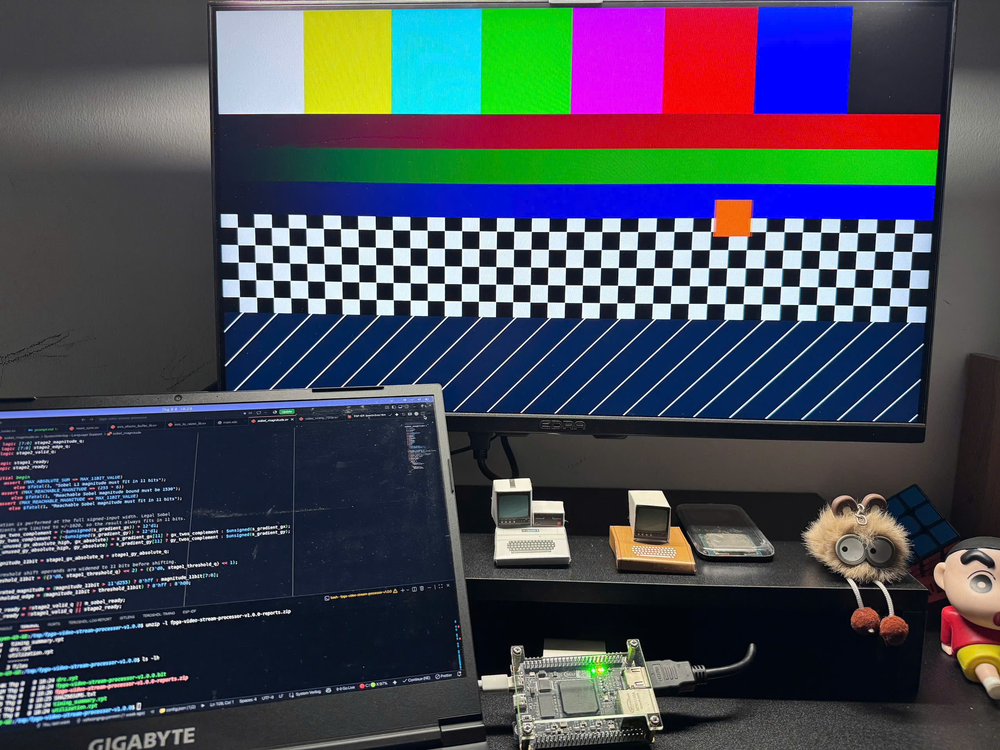
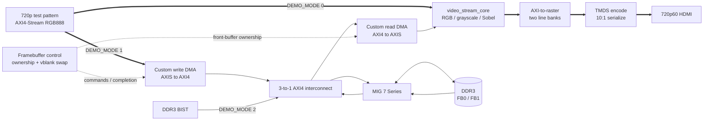
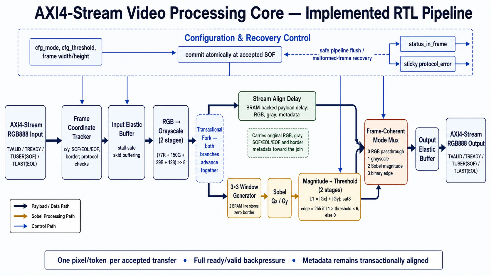

# FPGA Video Stream Processor

[](https://github.com/vohoangnguyennnn/fpga-video-stream-processor/actions/workflows/ci.yml)
[](rtl)
[](#verification)
[](#fpga-implementation)
[](LICENSE)

**A production-style 720p60 video-processing and DDR3 display engine built in SystemVerilog for a Xilinx Artix-7 FPGA.**

This project turns a pixel algorithm into a complete hardware subsystem: a reusable, backpressure-safe AXI4-Stream Video core; BRAM-based grayscale and Sobel processing; custom AXI4 framebuffer DMA; CDC-safe double buffering; raster reconstruction; and DVI-compatible HDMI output. The repository includes the specification, RTL, independent reference models, layered verification, board constraints, vendor-IP boundaries, and a reproducible Vivado flow.



> **Current maturity.** The portable RTL/model/cocotb regression passes, the DDR-enabled design closes post-route timing for `XC7A35T-2FGG484`, and the direct 1280×720p60 HDMI path has been demonstrated on the MicroPhase A7-Lite. The complete MIG-backed display path is implemented and simulation-verified; repeated physical DDR3/BIST/video validation remains the final hardware sign-off item.

## Why this project stands out

- Sustains **one accepted pixel per clock** under continuous traffic.
- Preserves RGB data, SOF, EOL, coordinates, mode, and threshold through arbitrary AXI4-Stream stalls.
- Builds a centered **3×3 sliding window from two BRAM line stores**, without buffering a full frame inside the processing core.
- Implements width-safe grayscale and Sobel arithmetic with explicit rounding, border, saturation, and threshold semantics.
- Uses custom **AXI4 write/read DMA engines** with response-qualified completion, XRGB8888 packing, aligned INCR bursts, and 4 KiB boundary protection.
- Provides **tear-free FB0/FB1 ownership** with vertical-blank promotion, late-frame repeat, and safe-black startup behavior.
- Crosses pixel/UI domains through Gray-pointer asynchronous FIFOs and synchronized event handshakes.
- Separates vendor-neutral RTL from board-specific MIG, Clocking Wizard, AXI Interconnect, and 7-series I/O primitives.
- Verifies arithmetic, protocol, memory traffic, recovery, and full-frame behavior against independent Python models.

## Architecture

Three statically elaborated build modes isolate bring-up risks while sharing the same board wrapper.



| `DEMO_MODE` | Build | Purpose |
| ---: | --- | --- |
| `0` | `DEMO_MODE=0 make vivado` | Direct diagnostic path: test pattern → processing core → HDMI |
| `1` | `DEMO_MODE=1 make vivado` | Flagship path: test pattern → DDR3 double buffer → processing core → HDMI |
| `2` | `DEMO_MODE=2 make vivado` | Destructive DDR3 BIST and board bring-up |

The reusable processing core remains unaware of DDR3, physical addresses, MIG, or the display connector. A deeper walkthrough of module ownership, DMA behavior, buffer state, clock domains, reset, and error containment is in [Architecture](docs/architecture.md).

## Reusable AXI4-Stream video core



The core accepts one RGB888 pixel per AXI4-Stream transfer:

| Field | Meaning |
| --- | --- |
| `TDATA[23:16]` | Red |
| `TDATA[15:8]` | Green |
| `TDATA[7:0]` | Blue |
| `TUSER[0]` | Start of frame |
| `TLAST` | End of active line |
| Transfer | State advances only on `TVALID && TREADY` |

Configuration is sampled atomically on an accepted SOF, so a mid-frame button or register change cannot split one frame across two modes.

| Mode | Operation | Display result |
| ---: | --- | --- |
| `0` | Passthrough | Original RGB888 |
| `1` | Grayscale | Integer BT.601 approximation replicated to RGB |
| `2` | Sobel magnitude | Saturated `abs(Gx) + abs(Gy)` |
| `3` | Binary edge | White when magnitude is greater than `threshold × 6` |


The left matrix is the horizontal kernel `Gx`; the right matrix is the vertical kernel `Gy`. Both gradients are evaluated in parallel from the same centered 3×3 grayscale window.

The numeric contract is intentionally bit-exact:

```text
gray = (77R + 150G + 29B + 128) >> 8
magnitude = abs(Gx) + abs(Gy)
edge = magnitude > threshold × 6
```

Sobel output uses zero padding at the image border. Passthrough and grayscale retain the actual border pixels. Detailed arithmetic ranges, scheduling, drain behavior, malformed-stream recovery, and acceptance criteria live in the [design specification](docs/design-spec.md).

## DDR3 framebuffer engine

The flagship mode stores complete 1280×720 frames as XRGB8888 in two fixed 4 MiB slots.

| Property | Value |
| --- | ---: |
| Active image | 1280 × 720 |
| Stored format | XRGB8888, 4 bytes/pixel |
| Stride | 5120 bytes |
| Framebuffer bases | `0x00000000`, `0x00400000` |
| AXI data width | 128 bits |
| Nominal burst | 16 beats / 256 bytes |
| Full-frame traffic | 921,600 pixels, 14,400 bursts per direction |

The writer crosses into `ui_clk`, validates frame markers, packs four pixels per AXI beat, and publishes a completed buffer only after the last successful `BRESP`. The reader prefetches the selected front buffer, checks AXI read responses, regenerates SOF/EOL, and crosses back to `pix_clk`. If the next buffer is not complete at vertical blank, the controller repeats the previous frame instead of exposing a partially written image.

## Verification

One command runs the portable regression used by GitHub Actions:

```bash
make ci
```

| Verification layer | Evidence | Status |
| --- | --- | --- |
| Static RTL | Complete hierarchy plus standalone memory blocks linted with Verilator | Pass |
| Unit RTL | 22 self-checking SystemVerilog block tests | 22/22 pass |
| Integration RTL | Core, top, full-frame DMA, loopback, and framebuffer subsystem | 6/6 pass |
| Reference models | Video arithmetic plus framebuffer layout/ownership models | 16/16 pass |
| cocotb | Image-level scoreboards, randomized stalls, AXI memory behavior, and error recovery | 5/5 pass |
| Full-frame DMA | 921,600-pixel write and read tests; 14,400 read bursts | Pass |
| Board-top simulation | 720p timing and frame-lock reacquisition | Pass |

Verification does not rely on visual plausibility. Scoreboards reconstruct frames only from accepted transfers and compare every pixel and sideband against an independent model. Directed tests cover prolonged stalls at SOF/EOL, final-frame drain, threshold equality, signed Sobel extrema, response errors, malformed streams, and ownership recovery.


The cursor marks a stalled end-of-line pixel in the grayscale phase: `m_axis_tvalid=1`, `m_axis_tready=0`, and `output_transfer=0`. While the receiver is stalled, `TDATA=0x191919`, `TUSER`, and `TLAST=1` remain stable; the output advances only after an accepted `TVALID && TREADY` transfer. The same capture also includes stalls at SOF and at an intermediate pixel.

See [Verification results](docs/verification-results.md), the [verification plan](docs/verification-plan.md), and the [Questa waveform workflow](docs/questa-waveform.md).

## FPGA implementation

Latest local post-route DDR-enabled result:

| Item | Result |
| --- | ---: |
| Target | `xc7a35tfgg484-2` |
| Configuration | `DEMO_MODE=1` |
| Vivado | 2024.1 |
| Setup | WNS `+0.744 ns`, TNS `0.000 ns`, 0 failing endpoints |
| Hold | WHS `+0.050 ns`, THS `0.000 ns`, 0 failing endpoints |
| Slice LUTs | 8,627 / 20,800 (41.5%) |
| Slice registers | 6,896 / 41,600 (16.6%) |
| Block RAM tiles | 10.5 / 50 (21.0%) |
| Estimated on-chip power | 1.127 W, low-confidence vectorless estimate |


The routed `DEMO_MODE=1` build meets all reported setup, hold, and pulse-width constraints with zero failing endpoints. `WPWS=0.000 ns` is reported with zero total violation and zero pulse-width failures, so it is not a negative-slack violation.

<p align="center">
  
  
</p>

The power value is a Vivado estimate, not a bench measurement. Detailed report interpretation, reproducibility requirements, reviewed MIG warnings, and remaining sign-off work are documented in [FPGA build and implementation](docs/fpga-build.md).

## Hardware status

The direct path has produced a stable 1280×720p60 test pattern over the board's HDMI connector. The photo above is hardware evidence for clocking, raster generation, TMDS encoding/serialization, pin constraints, and physical video output in diagnostic mode.

DDR DMA, BIST, ownership, and swap behavior are verified in simulation and included in the routed `DEMO_MODE=1` design. Cold-boot MIG calibration, full-aperture BIST, long-duration DDR video, and repeated power-cycle results must be recorded before claiming complete DDR hardware closure. See [Hardware validation](docs/hardware-validation.md).

## Quick start

### Requirements

- Python 3.10 or newer
- Verilator and the OSS CAD Suite used by CI
- AMD/Xilinx Vivado 2024.1 for FPGA implementation
- QuestaSim only for the optional curated waveform flow

### Portable regression

```bash
python3 -m venv .venv
source .venv/bin/activate
python -m pip install --requirement requirements-dev.txt
make ci
```

Focused targets are available through `make help`, including unit, integration, model, cocotb, Questa, and Xsim runs.

### Vivado build

```bash
# Direct diagnostic path
DEMO_MODE=0 make vivado

# DDR3 framebuffer path
DEMO_MODE=1 make vivado

# Standalone destructive BIST
DEMO_MODE=2 make vivado
```

The batch flow creates a project under `build/vivado/`, runs synthesis and implementation, generates the bitstream, and fails on negative setup/hold slack or unconstrained internal logic. Generated projects, caches, logs, and bitstreams are intentionally excluded from source control.

## Repository map

```text
rtl/core/          Reusable AXI4-Stream processing pipeline
rtl/framebuffer/   Async FIFO, custom WDMA/RDMA, ownership controller
rtl/fpga/          Board clock/reset, MIG boundary, raster, TMDS, top level
rtl/pkg/           Shared video and framebuffer contracts
models/            Independent bit-accurate Python reference models
tb/unit/           Self-checking block-level SystemVerilog tests
tb/integration/    Core, DMA, framebuffer, and board integration tests
tb/cocotb/         Python-driven image and AXI scoreboards
constraints/       Board, DDR3, timing, and CDC constraints
ip/                Checked-in customization inputs for generated Xilinx IP
fpga/vivado/       Reproducible Tcl implementation flow
questa/            Deterministic waveform/debug environment
docs/              Specification, architecture, verification, and sign-off notes
```

## Engineering boundaries

This is intentionally a fixed-function FPGA display engine, not a Linux video platform.

- Procedural test-pattern source; no camera or HDMI receiver.
- Fixed 1280×720p60 timing and fixed XRGB8888 framebuffer layout.
- No CPU, AXI4-Lite register bank, software driver, scaler, audio, HDCP, EDID, or CEC.
- DVI-compatible video signaling over an HDMI connector.
- Xilinx MIG and AXI Interconnect are infrastructure; the video core, DMA engines, async FIFO, ownership policy, raster bridge, and TMDS datapath are project RTL.

These boundaries keep the project focused on front-end RTL architecture, flow control, CDC/reset, memory traffic, verification, and FPGA implementation.

## Documentation

- [Product and design specification](docs/design-spec.md)
- [Architecture deep dive](docs/architecture.md)
- [Verification plan](docs/verification-plan.md)
- [Verification results](docs/verification-results.md)
- [FPGA build and implementation](docs/fpga-build.md)
- [Hardware validation](docs/hardware-validation.md)
- [Questa waveform workflow](docs/questa-waveform.md)
- [Release checklist](docs/release-checklist.md)
- [cocotb environment](tb/cocotb/README.md)

## License

Released under the [MIT License](LICENSE).
