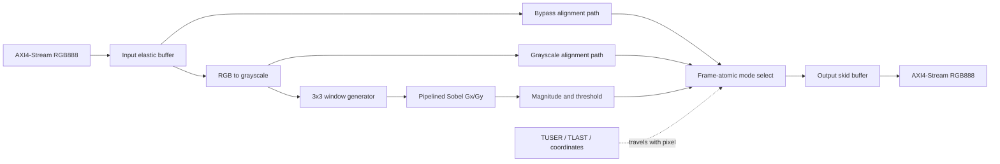

# FPGA Video Stream Processor

A production-style, real-time video-processing IP built in SystemVerilog and
deployed on the MicroPhase A7-Lite 35T.

> Project status: **architecture and verification scope frozen; RTL implementation
> has not started yet.** The repository intentionally separates planned targets
> from measured results.

## Project objective

The first release implements a reusable AXI4-Stream Video pipeline that accepts
one RGB888 pixel per transfer and produces selectable passthrough, grayscale,
Sobel magnitude, or thresholded edge output.

The design is intended to demonstrate front-end RTL engineering skills beyond
the image-processing algorithm itself:

- protocol-correct ready/valid flow control under arbitrary backpressure;
- BRAM-based sliding-window generation without a frame buffer;
- signed, width-safe, deeply pipelined arithmetic;
- frame metadata alignment across variable-latency stalls;
- constrained-random, assertion-based, and image-level verification;
- reproducible Vivado synthesis, timing, utilization, and hardware evidence.

## Target

| Item | Release target |
| --- | --- |
| FPGA board | MicroPhase A7-Lite 35T |
| FPGA | Artix-7 XC7A35T, FGG484, speed grade -2 |
| Reference clock | 50 MHz onboard oscillator on FPGA pin J19 |
| Demo output | HDMI 1280×720p60 |
| Core stream | AXI4-Stream Video, RGB888, one pixel per beat |
| Core throughput | One accepted/output pixel per cycle in steady state |
| Core timing goal | At least 100 MHz after place-and-route |
| Border policy | Constant-zero border, output dimensions preserved |
| Control | Width, height, mode, and threshold; committed atomically at SOF |

The exact FPGA ordering code and board revision must be checked against the
device marking and schematic before bitstream generation.
This target is the MicroPhase A7-Lite, not the Digilent Arty A7; their XDC
files are not interchangeable.

## Architecture



The board demonstration wraps the reusable core with a clock/reset subsystem,
a procedural video source, video timing generation, and a TMDS HDMI transmitter.
The core itself contains no Xilinx primitives.

## Release scope

The v1.0 acceptance target is:

1. Bit-accurate RGB-to-gray and Sobel results against a NumPy reference model.
2. No pixel or metadata loss under randomized input gaps and output
   backpressure.
3. Correct reset and recovery at frame boundaries.
4. 640×480 and 1280×720 regressions passing in CI.
5. 720p60 HDMI hardware demonstration on A7-Lite 35T.
6. Published post-route timing/utilization results and an ILA capture.

Camera capture, DDR3 frame buffering, 1080p60, Gaussian filtering, morphology,
and software drivers are deliberately outside v1.0. They are tracked as later
extensions rather than implied features.

## Documentation

- [Product and design specification](docs/design-spec.md)
- [Verification plan](docs/verification-plan.md)
- [Implementation roadmap](docs/design-spec.md#implementation-roadmap)
- [Portfolio and evidence plan](docs/design-spec.md#portfolio-and-engineering-evidence-plan)

## Planned repository layout

```text
rtl/pkg/                    Shared synthesizable packages
rtl/core/                   Vendor-neutral reusable processing RTL
rtl/board/a7_lite_35t/      Board-only RTL and primitive wrappers
tb/unit/                    Unit tests
tb/integration/             Core and board-subsystem tests
tb/assertions/              Bind interfaces and SVA
models/                     Bit-accurate Python golden model
sim/                        Simulator file lists and run scripts
constraints/a7_lite_35t/    Board and timing constraints
fpga/a7_lite_35t/           Non-project-mode Vivado entry points
scripts/                    Lint, regression, synthesis, and report scripts
docs/                       Specifications and measured reports
artifacts/                  Small reviewed evidence
```

Generated Vivado projects, waveforms, bitstreams, caches, and third-party
reference repositories are not source-controlled.

## Board facts

The scope is based on the
[MicroPhase A7-Lite reference manual](https://fpga-docs.microphase.cn/projects/documentation-of-microphase-fpga-board/en/latest/DEV_BOARD/A7-LITE/A7-Lite_Reference_Manual.html),
which documents the 50 MHz oscillator, XC7A35T option, 50 36-Kb BRAM blocks,
90 DSP slices, and onboard HDMI output.

## License

Released under the [MIT License](LICENSE).
