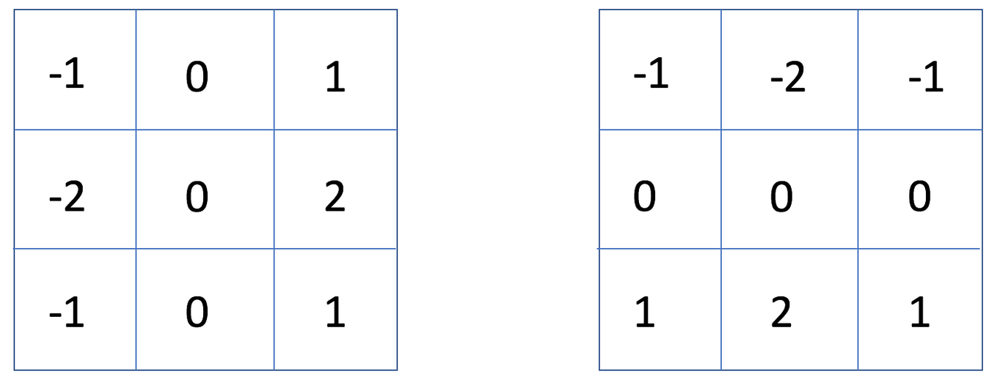

# Architecture Deep Dive

## 1. Design intent

The project is split into three boundaries with different portability and verification responsibilities:

1. `rtl/core/` is a vendor-neutral AXI4-Stream Video processing IP.
2. `rtl/framebuffer/` contains custom, vendor-neutral memory-traffic and ownership logic.
3. `rtl/fpga/` owns board clocks, resets, generated Xilinx infrastructure, raster timing, and physical HDMI output.

This separation is deliberate. The image algorithm can be reused without MIG or HDMI, while the board build can use Xilinx primitives without leaking them into the processing datapath.

## 2. Top-level configurations

`top.sv` selects one of three configurations at elaboration time through `DEMO_MODE`.

| Mode | Included path | Intended use |
| ---: | --- | --- |
| `0` | Test pattern → video core → raster → TMDS | Isolate clock/video/output bring-up from DDR3 |
| `1` | Test pattern → WDMA → DDR3 → RDMA → video core → raster → TMDS | Full display engine |
| `2` | BIST → AXI interconnect → MIG → DDR3 | Destructive memory qualification |

The selection is static rather than a runtime mux. Vivado can remove inactive infrastructure, and a failed or uncalibrated DDR interface cannot affect the direct diagnostic image.

## 3. Processing-core microarchitecture

### 3.1 Transaction contract

Every stage uses ready/valid flow control. Payload and sidebands advance only when both `valid` and `ready` are high. A stage holding an unaccepted output must preserve data, SOF, and EOL until the receiver accepts the transfer.

`video_payload_t` keeps the data and metadata correlated through the pipeline. It includes the original RGB pixel, grayscale value, coordinate/border information, frame markers, mode, threshold, and internal end-of-frame state needed by the scheduler.

Input and output elastic buffers break the long external ready cone. This avoids making upstream acceptance depend combinationally on every internal stage and on the final receiver.

### 3.2 Frame tracking and configuration

`frame_coord_tracker` derives `(x,y)` only from accepted transfers. An accepted SOF atomically captures width, height, mode, and threshold. Those active values remain unchanged until the next legal frame.

The tracker detects malformed SOF/EOL placement and illegal geometry. `video_stream_core` records a sticky protocol error and performs a controlled pipeline flush only when doing so cannot overwrite an output transaction already stalled at the interface. The next legal SOF re-establishes frame alignment.

### 3.3 Grayscale and branch alignment

The grayscale path implements:

```text
Y = (77R + 150G + 29B + 128) >> 8
```

The explicit `+128` defines round-to-nearest behavior before the binary shift. The coefficients sum to 256, so white maps exactly to white and the result naturally fits in eight bits.

After grayscale conversion, one accepted transaction is forked into:

- the neighborhood-processing branch; and
- the RGB/grayscale alignment branch.

The fork advances only when both branches can accept the same token. This prevents independent stalls from duplicating or dropping one side of the later join.

### 3.4 Window generation and border drain

`window_3x3` uses two previous-line memories plus horizontal shift registers to construct a centered 3×3 neighborhood. The memories are BRAM-oriented and are not reset; validity and coordinates prevent stale contents from becoming observable.

The centered window requires future row/column context. At the final input pixel, the scheduler temporarily blocks a new frame and drains only the real stored payloads required to produce the bottom border. Drain cycles are internal and do not become dummy AXI transfers. The external result remains exactly `width × height` pixels with one SOF and one EOL per line.

### 3.5 Sobel arithmetic

The horizontal and vertical kernels are evaluated as signed 12-bit gradients:



The left matrix is `Gx`; the right matrix is `Gy`. Both operate on the same
centered grayscale window and are evaluated in parallel.

The legal gradient range is ±1020. Magnitude uses the hardware-friendly L1 approximation:

```text
M = abs(Gx) + abs(Gy)
```

The reachable sum is retained before saturation to eight bits. Binary mode compares the unsaturated magnitude against `threshold × 6`, using a strict greater-than relation. Zero padding is selected for Sobel borders; passthrough and grayscale select the aligned real pixel instead.

## 4. Framebuffer memory architecture

### 4.1 Fixed layout

`framebuffer_pkg.sv` is the shared source of truth for geometry, packing, addresses, AXI widths, and static invariants.

| Property | Value |
| --- | ---: |
| Active resolution | 1280 × 720 |
| Storage | XRGB8888 |
| Active line/stride | 5120 bytes |
| Active frame | 3,686,400 bytes |
| FB0 | `0x00000000`–`0x003FFFFF` |
| FB1 | `0x00400000`–`0x007FFFFF` |
| AXI beat | 128 bits / four pixels |
| Nominal burst | 16 beats / 256 bytes |

Elaboration checks enforce slot alignment, non-overlap, capacity, MIG aperture containment, beat alignment, and a burst size that divides a 4 KiB region. A broken layout fails during elaboration instead of becoming a board-only address corruption.

### 4.2 Write DMA

`framebuffer_write_dma` contains four responsibilities:

1. Validate SOF/EOL against fixed frame geometry in `pix_clk`.
2. Cross RGB payloads through a dual-clock FIFO.
3. Pack four RGB888 pixels into one 128-bit XRGB8888 AXI beat.
4. Generate and complete AXI4 AW/W/B transactions in `ui_clk`.

Only one burst is outstanding. The address generator emits aligned INCR bursts and splits before a 4 KiB boundary. A frame is successful only after the last accepted `BRESP` is `OKAY` with the expected ID. The first error category, address, and response are retained rather than overwritten by later failures.

### 4.3 Read DMA

`framebuffer_read_dma` issues fixed-geometry AR bursts, checks ID/response/`RLAST`, and stages returned beats before the pixel side consumes them. XRGB8888 is unpacked back to RGB888, while SOF and EOL are regenerated from trusted local counters.

Prefetching and the asynchronous FIFO absorb bounded UI service variation. They do not make a non-stallable raster immune to unlimited DDR latency; underflow avoidance remains a memory-bandwidth and hardware-validation requirement.

## 5. Double-buffer ownership

`framebuffer_control` owns both slots in the MIG UI domain. The legal state encoding is:

```text
FREE → WRITING → READY → READING → FREE
             └────────failure────────→ FREE
```

Key invariants are asserted in simulation:

- front and back indices are always different;
- a displayed front slot is `READING`;
- a back slot is never `READING`;
- WDMA never writes the displayed front buffer;
- RDMA always reads the selected front buffer;
- read and write in-flight operations never target the same slot.

Startup begins with both slots invalid. FB0 is filled first, but HDMI remains black until a successful write reaches `READY` and a later vertical blank promotes it. A completed old front becomes the next free back slot atomically with promotion.

If the back buffer is incomplete or failed at vertical blank, the controller launches another read of the complete current front and asserts `status_repeat_frame`. If the previous read misses its deadline, no unsafe mid-frame command is started; recovery waits for the next real blanking event.

## 6. Clock domains and CDC

| Domain | Nominal clock | Owned logic |
| --- | ---: | --- |
| Board | 50 MHz | Root input clock and initial reset request |
| Pixel | 74.21875 MHz | Test pattern, video core, pixel-side DMA, raster, TMDS encoders |
| TMDS | 371.09375 MHz | OSERDESE2 serialization; exact 5:1 relation to pixel clock |
| MIG UI | 100 MHz | DMA burst engines, ownership controller, BIST, AXI fabric, MIG user port |

Pixel/UI payloads cross through `axis_async_fifo`. Binary pointers remain local; Gray-coded pointers pass through two destination-domain synchronizer stages marked `ASYNC_REG`. Full and empty decisions are made only from local pointers and synchronized Gray values.

Vertical blank is an event, not a persistent level. It crosses through a toggle/acknowledge protocol so a one-cycle `pix_clk` pulse cannot disappear in `ui_clk`. Display-valid and sticky status cross as synchronized levels. Pixel/TMDS clocks are related generated clocks rather than an asynchronous CDC pair.

## 7. Reset and startup sequencing

Reset assertion may originate asynchronously, but functional state is released synchronously in each destination domain.

For DDR-enabled builds:

1. The 50 MHz board clock feeds the DDR clock generator.
2. MIG system/reference clocks become stable.
3. MIG performs PHY calibration.
4. `ui_reset` remains asserted until clock locks and `init_calib_complete` are valid.
5. BIST owns the AXI fabric and qualifies the framebuffer aperture.
6. Only a successful BIST releases the framebuffer video subsystem.
7. The first complete frame is written and promoted at vertical blank.

FIFO RAM and line RAM contents are not reset. Resetting pointer/valid/control state is sufficient and preserves BRAM inference.

## 8. Raster and HDMI output

`axis_to_raster` bridges a stallable AXI stream to fixed 1280×720 active video within a 1650×750 timing envelope. Two complete line banks provide line-atomic reservation and switching. Before lock or after a detected fill failure, the visible fallback is black rather than stale partial data.

Each RGB channel is converted into a 10-bit TMDS symbol. During blanking, the blue channel carries horizontal and vertical control symbols. Three OSERDESE2 instances serialize the channels at ten bits per pixel using single-data-rate input and double-data-rate output behavior from a 5× clock. The result is DVI-compatible video over the board's HDMI connector; audio and HDMI auxiliary protocols are outside scope.

## 9. Error containment and observability

The design exposes or internally retains failures for:

- malformed AXI4-Stream frame markers;
- FIFO overflow/underflow conditions;
- AXI ID, response, or `RLAST` mismatch;
- failed write/read frames;
- ownership invariant violations;
- missed read deadlines;
- MIG calibration or BIST failure;
- raster underflow/frame-lock loss.

Errors are sticky where losing a one-cycle event would hinder debug. Invalid or partial frames are never promoted. Startup and loss-of-service behavior prefer a black or repeated complete frame over visually plausible but untrusted data.

## 10. Vendor ownership boundary

Project RTL owns the image pipeline, async FIFO, DMA engines, buffer policy, BIST, raster bridge, TMDS encoding, and board integration policy. Xilinx owns the generated MIG PHY/controller, Clocking Wizards, AXI Interconnect, and physical output primitives. This boundary avoids pretending that DDR3 training is custom logic while keeping the portfolio-relevant memory traffic and correctness policy reviewable in SystemVerilog.

For normative interface and numeric requirements, see [design-spec.md](design-spec.md). For evidence that these behaviors are exercised, see [verification-results.md](verification-results.md).
