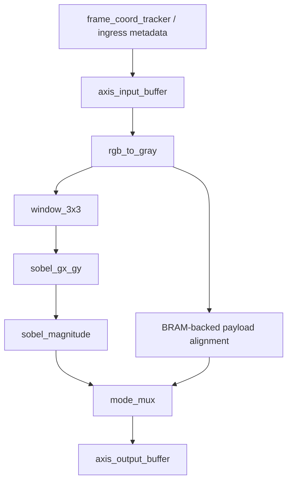
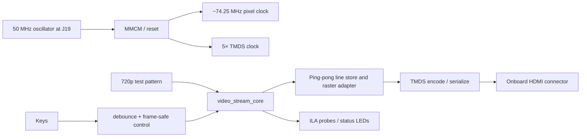
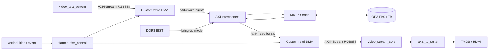

# FPGA Video Stream Processor — Product and Design Specification

| Field | Value |
| --- | --- |
| Document status | v1.0 streaming baseline plus fixed-function v2.0 DDR3 flagship scope |
| Target board | MicroPhase A7-Lite 35T |
| Target device | Artix-7 XC7A35T-2FGG484; speed grade `-2` confirmed from the fitted device marking |
| Primary language | SystemVerilog |
| Primary demo | 1280×720p60 DDR3 double-buffered processing and HDMI |

## 1. Product statement

This project will deliver a reusable, vendor-neutral streaming video-processing
IP and a board-level proof of operation. The IP converts RGB888 to grayscale,
forms a 3×3 neighborhood using line buffers, applies a Sobel operator, and
selects one of four output modes without buffering a complete frame.

The flagship v2.0 system extends that verified kernel into a fixed-geometry,
memory-backed video pipeline. Custom AXI4 framebuffer DMA engines move complete
frames between external DDR3 and AXI4-Stream, while a custom controller owns
two framebuffer slots and performs tear-free frame-boundary swaps. Xilinx MIG
7 Series remains the board-specific DDR3 controller and PHY; it is
infrastructure, not part of the portable image-processing algorithm.

The product is not merely a visual demo. Protocol behavior, arithmetic widths,
configuration semantics, reset recovery, verification closure, timing closure,
and measured FPGA cost are first-class requirements.

## 2. Scope

### 2.1 v1.0 features

- One RGB888 pixel per AXI4-Stream transfer.
- AXI4-Stream Video framing:
  - `TUSER[0]`: start of frame (SOF), asserted on the first pixel only.
  - `TLAST`: end of line (EOL), asserted on the final pixel of every active line.
- Four output modes, always represented as RGB888:
  - `0`: RGB passthrough;
  - `1`: grayscale replicated on R, G, and B;
  - `2`: Sobel magnitude replicated on R, G, and B;
  - `3`: binary edge map replicated on R, G, and B.
- Runtime-selectable unsigned 8-bit threshold.
- Configuration changes become visible atomically on the next accepted SOF.
- Runtime-configured frame width and height, checked against framing markers
  and bounded by synthesis parameters `MAX_WIDTH` and `MAX_HEIGHT`.
- Constant-zero, one-pixel border with unchanged output frame dimensions.
- Arbitrary input bubbles and output backpressure without data corruption.
- Sticky protocol-error telemetry for malformed lines or frames.
- Synthesizable, vendor-neutral processing core.
- MicroPhase A7-Lite 35T integration with procedural test pattern and HDMI.

### 2.2 Explicitly out of scope for v1.0

- HDMI or DVP camera input.
- DDR3 frame buffering and clock-rate conversion by full frames.
- AXI4-Lite, Wishbone, processor subsystem, or software driver.
- Gaussian blur, morphology, Canny, Hough transform, or neural networks.
- Multiple pixels per clock.
- Interlaced video and chroma-subsampled input formats.
- 1080p60 timing closure as a release criterion.
- HDCP, HDMI audio, EDID negotiation, or CEC.

These are valid follow-on releases, but none are required to call v1.0
complete.

### 2.3 Approved v2.0 flagship scope

- Xilinx `MIG 7 Series` configured from the verified A7-Lite schematic and
  fitted DDR3 device, with AXI4 user interface enabled.
- A custom AXI4-Stream-to-AXI4 write DMA that stores the procedural test-pattern
  frame in the non-displayed DDR3 buffer.
- A custom AXI4-to-AXI4-Stream read DMA that fetches the displayed DDR3 buffer
  and presents legal RGB888 frames to the existing `video_stream_core`.
- Two external-memory framebuffer slots with explicit ownership and a
  tear-free swap at vertical blanking. A missed producer deadline repeats the
  previous complete frame rather than displaying a partially written frame.
- A deliberately fixed 1280×720p60 memory contract: XRGB8888 storage, a
  5,120-byte stride, 4-MiB slots at offsets `0x0000_0000` and `0x0040_0000`,
  and RGB888 AXI4-Stream interfaces at the processing boundary.
- Independent pixel and MIG UI clock domains connected only through reviewed
  asynchronous FIFOs and explicit event handshakes.
- A build-time top-level parameter selects direct-video, DDR-video, or BIST
  hardware images. Compile-time constants own framebuffer geometry and
  addresses; v2.0 has no processor, AXI4-Lite control plane, interrupt
  controller, or runtime memory map.
- Sticky AXI, protocol, FIFO, underflow, and DDR-calibration status, plus
  optional ILA probes and a deterministic recovery policy.
- A memory-system verification environment with an AXI memory model, randomized
  stalls/latency, response-error injection, buffer-ownership assertions, and
  pixel-exact frame scoreboarding.

The v2.0 baseline is a fixed-function memory-backed display-processing
pipeline: DDR3 is read into `video_stream_core`, and the processed stream is
sent to HDMI. Runtime programmability, processed-result writeback, camera
capture, and a CPU subsystem are deliberately deferred until this two-buffer
path is closed.

## 3. Success criteria

### 3.1 v1.0 streaming-core criteria

v1.0 is complete only when all of the following evidence exists:

| ID | Acceptance criterion |
| --- | --- |
| AC-01 | All lint errors are resolved; intentional warnings are documented. |
| AC-02 | Directed and randomized regressions pass on two supported simulators. |
| AC-03 | Every legal output frame is pixel-exact against the reference model. |
| AC-04 | Random backpressure and input gaps produce no loss, duplication, or metadata displacement. |
| AC-05 | After reset release, no output transfer occurs before a new legal input SOF, and the next output frame starts with its matching SOF. |
| AC-06 | Post-route core Fmax is at least 100 MHz on XC7A35T-2FGG484. |
| AC-07 | Board top meets the 720p60 clock constraints without timing exceptions hiding violations. |
| AC-08 | HDMI shows all four modes, and threshold changes occur only at frame boundaries. |
| AC-09 | Utilization, timing, power estimate, and latency are reported from the tagged release. |
| AC-10 | CI can reproduce lint and simulation from a fresh clone. |
| AC-11 | With a legal continuous input frame and an output that has remained ready since SOF, the core accepts one pixel per clock from the accepted SOF through the final input pixel; border handling creates no self-induced mid-line stall. |
| AC-12 | An automated post-elaboration or post-synthesis structural check proves that no combinational timing path exists from top-level `m_axis_tready` to top-level `s_axis_tready`. |
| AC-13 | The board XDC constrains `clk_50m` at J19 as a 20.000 ns LVCMOS33 primary clock; implementation reports no unconstrained clocks or endpoints. |
| AC-14 | RTL collision tests and the Vivado inference report prove the specified old-line/read-before-write line-buffer behavior. |
| AC-15 | After raster frame lock, a release run completes without underflow, overflow, fallback frame, line-tag mismatch, or mid-line bank switch. |

No frequency, utilization, power, or latency number is published as achieved
until it comes from a checked-in report generated from the release commit.

### 3.2 v2.0 DDR3 framebuffer criteria

v2.0 is complete only when the v1.0 criteria remain passing and all of the
following evidence exists:

| ID | Acceptance criterion |
| --- | --- |
| AC2-01 | The checked-in MIG configuration names the fitted DDR3 component, board revision, FPGA part, pinout source, reference clock, UI clock, AXI width, and usable address range; no value is copied from an unverified board preset. |
| AC2-02 | MIG reaches `init_calib_complete` on every release power-cycle trial, and a destructive standalone BIST passes the framebuffer aperture before the video datapath is enabled. |
| AC2-03 | The custom write DMA produces legal AXI4 INCR bursts, never crosses a 4-KiB boundary, never reuses a back buffer before the final successful `BRESP`, and writes a pixel-exact frame under randomized AW/W/B backpressure. |
| AC2-04 | The custom read DMA supports randomized AR/R latency and AXI4-Stream backpressure without loss, duplication, reordering, or incorrect SOF/EOL metadata. |
| AC2-05 | XRGB8888 packing/unpacking, the fixed 5,120-byte stride, and both fixed framebuffer slots are byte-exact against the memory reference model. |
| AC2-06 | Assertions prove that a buffer is never written while owned by the reader and is never promoted for display before its complete write response has retired. |
| AC2-07 | Buffer selection changes only at the specified vertical-blank event; a late or failed writer causes a complete-frame repeat, never a mixed or partially written frame. |
| AC2-08 | The complete path `test pattern → DDR3 → video_stream_core → HDMI` runs at 1280×720p60 with zero post-lock underflow, overflow, protocol, AXI, or fallback-frame events. |
| AC2-09 | A concurrent read/write hardware run sustains the fixed 720p60 workload with at least 25% measured payload-bandwidth margin over its average demand and no post-lock underflow. |
| AC2-10 | CDC analysis reports only intentional reviewed crossings; asynchronous FIFOs and frame/swap event handshakes pass randomized phase/reset testing. |
| AC2-11 | Post-route implementation has non-negative WNS/TNS in every clock domain, zero unconstrained endpoints, clean DRC, and documented resource, clock, CDC, and bandwidth results. |
| AC2-12 | Hardware evidence includes MIG calibration/BIST status, observable buffer-swap evidence from either an ILA capture or documented diagnostic status/counters, and a recorded tear-free moving-pattern demonstration. If ILA is unavailable, the limitation and substitute observability must be stated explicitly. |

Simulation-only estimates are not accepted as measured DDR bandwidth, timing,
or hardware stability evidence.

## 4. External interface contract

### 4.1 Clock and reset

The v1.0 `video_stream_core` has one clock domain. The v2.0 subsystem clock and
CDC contract is specified separately in Section 14.8.

```systemverilog
input logic aclk;
input logic aresetn;
```

`aresetn` is active-low and synchronous to `aclk` at the core boundary. The
core samples it only on `aclk` edges. The board wrapper may accept an
asynchronous pushbutton or lock-loss request, but it must synchronize and
condition that request before generating the core reset; an asynchronously
changing reset net must not directly drive the synchronous core reset port.
Board-only primitives that require asynchronous assertion use separate,
domain-specific reset conditioners with synchronous release.

Transaction-derived state, including coordinates and line-buffer writes, changes
only on the corresponding accepted transfer. Internal elastic stages advance
only on their local handshakes. Reset clears valid state, counters, active
configuration, line-buffer validity, and error flags.

### 4.2 AXI4-Stream input

```systemverilog
input  logic [23:0] s_axis_tdata;
input  logic        s_axis_tvalid;
output logic        s_axis_tready;
input  logic        s_axis_tuser;
input  logic        s_axis_tlast;
```

Pixel packing is:

```text
s_axis_tdata[23:16] = R
s_axis_tdata[15:8]  = G
s_axis_tdata[7:0]   = B
```

One transfer represents exactly one active pixel. `TKEEP` is omitted because
all three bytes are always valid. A pixel is accepted only on:

```systemverilog
s_axis_tvalid && s_axis_tready
```

`TUSER` must be high only on coordinate `(0,0)`. `TLAST` must be high on the
last active pixel of each line, including the final line.

As required by AXI4-Stream, once the source asserts `s_axis_tvalid`, it must
hold `s_axis_tvalid`, `s_axis_tdata`, `s_axis_tuser`, and `s_axis_tlast`
stable until the transfer is accepted. A violation of this source-side rule is
outside the protocol-error detector's required coverage.

### 4.3 AXI4-Stream output

```systemverilog
output logic [23:0] m_axis_tdata;
output logic        m_axis_tvalid;
input  logic        m_axis_tready;
output logic        m_axis_tuser;
output logic        m_axis_tlast;
```

Output frame width and height equal input frame width and height. While
`m_axis_tvalid && !m_axis_tready`, `m_axis_tdata`, `m_axis_tuser`, and
`m_axis_tlast` must remain stable.

The output begins only after the centered-window look-ahead and arithmetic
pipeline are filled. The design may deassert `s_axis_tready` in response to
finite internal capacity and downstream backpressure, and while draining the
previous frame. For an otherwise unblocked legal frame, border scheduling must
not create an input bubble before the final input pixel. Latency is therefore
reported both as accepted-transfer look-ahead and as no-stall clock latency,
not as one unconditional cycle count.

### 4.4 Configuration and telemetry

The v1.0 core uses simple ports:

```systemverilog
input  logic [1:0] cfg_mode;
input  logic [7:0] cfg_threshold;
input  logic [15:0] cfg_frame_width;
input  logic [15:0] cfg_frame_height;
output logic       status_in_frame;
output logic       status_protocol_error;
```

All `cfg_*` inputs are synchronous to `aclk` and must meet normal setup/hold
requirements. The values present on the edge that accepts an input SOF are
copied together into active registers. Changes at any other time do not affect
the active frame; dimension validation and first-pixel border metadata use
those same sampled values. A producer in another clock domain must use a coherent
request/acknowledge transfer or asynchronous FIFO in its wrapper; independently
synchronizing the bits of a multi-bit configuration bus is prohibited.

`status_in_frame` describes a dimension-valid frame transaction in flight
through the core. It asserts when a legal input SOF is accepted and remains
high through look-ahead, post-final-input drain, and output stalls. It
deasserts only when that frame's final output transfer is accepted or when
malformed-frame recovery discards the frame. This definition remains
observable for a legal 1×1 frame.

Width and height are required because AXI4-Stream Video provides SOF and EOL
but no explicit end-of-frame marker. A centered 3×3 kernel must know the final
row before the next SOF arrives in order to emit the bottom border correctly.
Legal dimensions are `1..MAX_WIDTH` by `1..MAX_HEIGHT`. `MAX_WIDTH` and
`MAX_HEIGHT` must fit in the 16-bit configuration fields.

`status_protocol_error` is sticky until reset. At minimum it reports:

- an accepted pixel without SOF while the tracker is hunting for a frame;
- an unexpected SOF while a frame is active;
- zero or out-of-range configured dimensions at SOF;
- an accepted EOL at a column other than `active_width-1`;
- a missing EOL at `active_width-1`;
- an accepted pixel after the configured final pixel and before the next SOF.

Coordinate progression is based on the committed width and height, not on a
possibly malformed `TLAST`. A legal frame ends at the configured final pixel.
An SOF with illegal dimensions is consumed and flagged but does not start a
frame. A valid SOF always establishes a new coordinate origin; if it interrupts
an active malformed frame, queued work from the old frame may be discarded
after preserving any already-stalled output transfer. Pixel correctness is
guaranteed for legal frames; malformed-frame output is best-effort and the
sticky status flag is the contractual result. Error handling must not alter a
subsequent legal frame.

## 5. Numeric specification

### 5.1 RGB to grayscale

The conversion uses an integer BT.601-like approximation:

```text
gray = round((77·R + 150·G + 29·B) / 256)
     = (77·R + 150·G + 29·B + 128) >> 8
```

The implementation must:

- use unsigned products and a 16-bit unsigned sum including the rounding term;
- add 128 before the right shift to implement round-to-nearest with half-way
  cases rounded upward;
- return bits `[15:8]` of that sum without a saturating branch;
- pipeline multipliers/adders to meet the timing target.

The coefficients are fixed in v1.0 and sum to exactly 256, so the maximum
rounded result is 255. Elaboration-time checks must document the coefficient
sum and the maximum-width proof. Changing a coefficient is a specification,
golden-model, and width-review change rather than a dormant RTL feature.

The default implementation may infer three DSP48E1 multipliers. A
shift-and-add implementation can be evaluated only after the DSP and timing
reports are available.

### 5.2 Sobel operator


The left matrix is the horizontal kernel `Gx`; the right matrix is the
vertical kernel `Gy`. The expanded equations below remain the normative
arithmetic definition used by RTL and the golden model.

For grayscale samples `p00` through `p22`:

```text
Gx = -p00 + p02 - 2·p10 + 2·p12 - p20 + p22
Gy =  p00 + 2·p01 + p02 - p20 - 2·p21 - p22
```

`Gx` and `Gy` are signed and range from `-1020` to `+1020`. The implementation
uses at least 12 signed bits for each gradient.

The low-cost magnitude is:

```text
mag11      = abs(Gx) + abs(Gy)               // 11-bit, reachable range 0..1530
mag8       = min(255, mag11)
threshold11 = (cfg_threshold << 2)
            + (cfg_threshold << 1)            // cfg_threshold × 6, range 0..1530
edge        = 255 when mag11 > threshold11, else 0
```

Although the independent bounds on `Gx` and `Gy` give a conservative sum bound
of 2040, their extrema cannot occur simultaneously for one 8-bit Sobel window.
Using `|Gx| + |Gy| = max(±Gx ±Gy)`, the largest positive coefficient sum of
the four combined kernels is 6; therefore the reachable maximum is
`6 × 255 = 1530`. The 6× threshold scale uses the full 8-bit control range and
requires only shift-add logic. Both shift operands must be explicitly widened
to 11 bits before the shifts so SystemVerilog expression sizing cannot truncate
the comparison threshold.

The exact scaling and strict comparison above are part of the golden-model
contract. Consequently, threshold 0 selects only non-zero gradients and
threshold 255 disables all edges because no magnitude exceeds 1530. Equality
belongs to the non-edge case. The border override still forces zero.

### 5.3 Border behavior

Pixels on row `0`, row `height-1`, column `0`, or column `width-1` produce zero
in Sobel modes. Passthrough and grayscale modes retain their actual border
pixels. Every mode preserves frame dimensions and marker locations.

Frames smaller than 3×3 are legal. Sobel outputs all zeros for those frames.

## 6. Microarchitecture



### 6.1 Module ownership

| Module | Responsibility |
| --- | --- |
| `axis_elastic_buffer` | Break ready paths and hold payload stable during stall. |
| `rgb_to_gray` | Width-safe, pipelined RGB888 conversion. |
| `frame_coord_tracker` | At the top-level input handshake, validate committed dimensions, track coordinates, classify borders, check SOF/EOL, and drive protocol status before the enriched payload enters the input buffer. |
| `window_3x3` | Two BRAM line stores, horizontal taps, centered-window scheduling, drain control, and `window_valid`. |
| `sobel_gx_gy` | Signed convolution and pipeline registers. |
| `sobel_magnitude` | Absolute values, sum, saturation, and threshold. |
| `stream_align_delay` | BRAM-backed, stall-aware alignment of RGB, grayscale, border, and frame markers with the Sobel result. |
| `video_mode_mux` | Frame-coherent output selection. |
| `video_stream_core` | Integration, configuration commit, status, and assertions. |

### 6.2 Flow-control rule

The implementation will not use a free-running delay line for `TUSER`,
`TLAST`, or valid. The shared type is defined once in
`rtl/pkg/video_pkg.sv` and imported by the core and testbench:

```systemverilog
typedef struct packed {
    logic [23:0] rgb;
    logic [7:0]  gray;
    logic        sof;
    logic        eol;
    logic        eof;       // internal final-pixel tag; not an AXI output
    logic        border;
} video_payload_t;
```

A stage changes its registered payload only when empty or when the downstream
stage accepts the current payload. Line-buffer writes and coordinate counters
are enabled only by an accepted input transaction.

The split after grayscale is a transactional fork: an input token advances
only when both the window path and alignment path can accept it, and neither
branch may consume the same token twice. The mode-mux boundary is a
transactional join that consumes only the matched aligned payload and Sobel
result. All four modes therefore use the same framing latency; passthrough and
grayscale do not bypass the join early. Simulation-only sequence tags and
branch push/pop counters assert this one-to-one relationship.

There are two distinct flow-control requirements:

1. The reusable AXI core supports arbitrary downstream backpressure. Finite
   storage may therefore propagate a registered stall to `s_axis_tready` on
   any pixel; the source must hold its transfer until accepted.
2. With `m_axis_tready` continuously high from before an accepted SOF and no
   reset or protocol recovery, the core itself must remain bubble-free at one
   accepted pixel per clock through the final input pixel. Bottom-border drain
   occurs only after that final acceptance.

The board test-pattern source is handshake-driven and has no physical blanking
or sync timing. Pausing its logical AXI line is therefore legal; only the HDMI
raster side is non-stallable.

There must be no combinational timing path from top-level `m_axis_tready` to
top-level `s_axis_tready`. Boundary elastic buffers register that dependency.
This requirement does not ban legal module-local ready dependencies inside an
elastic stage. A netlist/timing-cone check, rather than source-text naming
heuristics, enforces the top-level requirement. The Yosys check treats every
sequential cell as a cut point and fails if a purely combinational path remains
from `m_axis_tready` to `s_axis_tready`; the Vivado post-synthesis timing query
is the release cross-check.

### 6.3 Line-buffer design

- Two logical `MAX_WIDTH × 8` memories retain the two prior grayscale rows.
- The RTL is written for simple dual-port BRAM inference.
- Compile-time assertions reject `MAX_WIDTH < 3`, `MAX_HEIGHT < 1`, or either
  maximum greater than 65,535. Runtime frames smaller than 3×3 remain legal.
- When the oldest-row bank is read and overwritten at the same address, the
  logical result must be the pre-write pixel (`READ_FIRST` behavior). The RTL
  coding template, simulation model, and inference report must agree; the
  design must not rely on an undocumented collision default.
- Three three-deep horizontal shift registers form the window taps.
- The line-store bank roles rotate at each accepted configured final column;
  `TLAST` is checked but does not control memory addressing. Pixel memory is
  not copied between rows.
- Buffer contents are qualified by row-valid state rather than cleared on
  reset, avoiding a large reset structure that prevents BRAM inference.

The core BRAM budget includes both line stores and the RGB/grayscale alignment
storage. A `MAX_WIDTH`-deep RGB delay implemented as flip-flops is not an
acceptable fallback.

### 6.4 Centered-window scheduling and drain

For a legal frame, output token `k` always corresponds to input token `k`, so
SOF, EOL, the internal EOF tag, RGB, grayscale, border classification, and
Sobel data cannot be reordered. A centered 3×3 result for an interior pixel
needs one future row and one future column. In raster order this is a
scheduling look-ahead of `active_width + 1` accepted input tokens. Arithmetic
registers add clock latency but do not change that token relationship.

After the final input pixel is accepted, the delayed right-edge and bottom-row
tokens remain. The scheduler stops accepting a new frame, injects the required
zero-border Sobel results, and drains exactly the remaining tokens. It emits
exactly `width × height` output transfers for every legal input frame and
asserts input ready for the next SOF only after the prior frame state is safe
to reuse. The drain length and maximum pipeline occupancy are reported by the
implementation; no dummy AXI pixels are accepted or emitted.

v1.0 does not overlap frames internally: the first pixel of frame `N+1` is not
accepted until the final output token of frame `N` has been accepted. A
back-to-back AXI source remains legal by holding the next SOF transfer while
`s_axis_tready` is low. This serialization is also what makes one set of active
configuration registers sufficient.

### 6.5 Pipeline partition

The arithmetic is initially partitioned as:

1. coefficient products for grayscale;
2. grayscale sum and rounding;
3. line-buffer/window update;
4. Sobel pair sums;
5. signed `Gx`/`Gy`;
6. absolute values;
7. magnitude sum, saturation, and threshold;
8. mode selection;
9. output skid buffer.

This is a partitioning hypothesis, not a fixed latency promise. Registers may
move during timing closure, provided the interface and image-level results do
not change.

## 7. Board demonstration architecture

### 7.1 Board identity and primary clock contract

The release board is the **MicroPhase A7-Lite 35T**, not the Digilent Arty A7.
An Arty A7 master XDC must not be reused. The only board pin fixed by this
document without further schematic review is the onboard 50 MHz oscillator:

```tcl
set_property PACKAGE_PIN J19 [get_ports clk_50m]
set_property IOSTANDARD LVCMOS33 [get_ports clk_50m]
create_clock -name clk_50m -period 20.000 \
    -waveform {0.000 10.000} [get_ports clk_50m]
```

The checked-in board XDC records its MicroPhase schematic revision and fitted
device marking. HDMI differential pairs, buttons, and LEDs are enabled only
after schematic-to-PCB review; copied constraints from a similarly named board
are not acceptable evidence.

### 7.2 Clock and reset architecture



`clk_50m` is used only by clock-management and startup/control logic. The MMCM
produces `pix_clk` near the nominal 74.25 MHz and the phase-related
`tmds_clk_5x`. The test-pattern generator, processing core, raster adapter,
video timing, TMDS encoder, serializer `CLKDIV` side, and OSERDESE2 reset all
use the pixel-domain reset qualified by `pix_clk`; only the serializer
high-speed clock input uses `tmds_clk_5x`, and there is no independent
TMDS-clocked fabric state.

The 50 MHz oscillator is converted to a pixel clock near the nominal 74.25 MHz
CEA rate and a phase-related 5× serializer clock. The exact 74.25/371.25 MHz
pair must not be claimed until Clocking Wizard or primitive parameters prove it:
MMCME2 multiplier/divider granularity may require a nearby legal rate. The
implemented frequencies, ratio, error from nominal, jitter estimate, and
generated-clock constraints are recorded from Vivado and checked against
Artix-7 and monitor limits.

A baseline single-MMCM candidate for Risk Spike A is
`M=59.375, D=4, O_pixel=10, O_serial=2`, which would produce
74.21875 MHz and 371.09375 MHz with an exact 5:1 ratio
(`-420.9 ppm` from nominal). It is not promoted to the release configuration
until the selected Vivado
version validates the primitive limits, jitter, clock routing, and placed
serializer.

MMCM `LOCKED` is not used as a combinational functional reset. An
asynchronously asserted, synchronously released request synchronizer captures
lock loss, but it does not directly drive functional logic. A second reset pipe
asserts and deasserts `pix_reset` only on `pix_clk` edges and holds it asserted
until the synchronized lock indication has remained high for at least four
additional pixel-clock edges. This separation prevents asynchronously reset
registers from driving BRAM address or control inputs. Lock loss disables
video, flushes valid/tag state, resets OSERDESE2 through its `CLKDIV`-timed
reset input, and requires reacquisition at a raster frame boundary. No TMDS or
active-video valid state may be released before `pix_reset` is released.

### 7.3 Raster and TMDS behavior

The v1.0 raster timing is fixed:

| Axis | Active | Front porch | Sync | Back porch | Total |
| --- | ---: | ---: | ---: | ---: | ---: |
| Horizontal pixels | 1280 | 110 | 40 | 220 | 1650 |
| Vertical lines | 720 | 5 | 5 | 20 | 750 |

Horizontal and vertical sync are active high. During active video, each RGB
channel is TMDS-encoded independently. During blanking, the blue channel carries
the standard control symbol selected by `{VSYNC, HSYNC}`, while red and green
carry control `00`. Audio/data islands, guard bands, and HDMI-specific packets
are absent; v1.0 is a DVI-compatible video stream on the HDMI connector.
Each data lane keeps an explicitly signed, width-safe running-disparity state
and resets it to zero during control periods. Serializer bit order
is proven with a captured known 10-bit word rather than inferred from a visual
monitor test.

The test pattern includes ramps, a checkerboard, diagonal lines, color bars,
and moving shapes. Those features make grayscale coefficients, Sobel polarity,
border behavior, and live threshold adjustment visible without an external
video source.

The AXI-to-raster adapter uses two RGB line banks. It reserves a complete empty
bank before accepting the first pixel of an incoming line; after that first
acceptance, it must keep `s_axis_tready` asserted through the configured final
pixel. The bank is marked complete by the accepted-pixel count; `TLAST` is
checked but does not control the bank. This line-atomic policy prevents the
adapter from applying mid-line backpressure to the core output.

The HDMI timing generator never waits for pixels. At each scheduled active-line
boundary, the adapter switches only to a completely filled bank. If no complete
line is available, it never switches banks mid-line or stretches video timing.

Display frame lock is acquired only at a raster frame boundary when a complete
source line tagged with SOF is available; otherwise the entire scheduled frame
is black. Pre-lock startup black is expected and does not assert underflow.
Once locked, source and raster line counters must match. If an
expected line is unavailable, the adapter outputs black for the remainder of
that raster frame, discards/resynchronizes the late source frame at its next
SOF, and raises a sticky underflow. This prevents one late line from shifting
all subsequent lines or creating a tear. Overflow, malformed-line, underflow,
and black-fallback status are exposed on an LED and optional ILA probe. A
release run must show zero fallback frames and lines after initial frame lock.

The board wrapper is permitted to instantiate Xilinx primitives for clocking,
TMDS serialization, and optional ILA. Such primitives must not leak into the
portable processing core.

## 8. Resource and timing budgets

Budgets are engineering limits, not measured results:

| Resource | Core budget | Board-top budget |
| --- | ---: | ---: |
| LUT | ≤ 4,000 | ≤ 10,000 |
| Flip-flop | ≤ 5,000 | ≤ 12,000 |
| 36-Kb BRAM equivalent | ≤ 4 | ≤ 10 |
| DSP48E1 | ≤ 6 | ≤ 10 |
| Core post-route Fmax | ≥ 100 MHz | N/A |
| 720p pixel domain WNS | ≥ 0 ns | ≥ 0 ns |

These leave margin for debug logic and later adapters on the 35T device.
Resource use is optimized only after correctness and timing are established.

The v2.0 memory subsystem has no fabricated fixed resource promise before the
MIG configuration is generated. Its release budget is constrained by fit and
margin: the complete non-ILA design must fit the verified device with at least
20% LUT/flip-flop and 10% BRAM headroom, meet timing in every domain, and
satisfy the streamlined bandwidth gate in Section 14.10. MIG, interconnect,
DMA, processing, and HDMI resources are reported separately so the cost of
custom RTL remains visible.

## 9. CDC, reset, and physical-design policy

- The processing core has no CDC.
- Board buttons are synchronized and debounced before use.
- On A7-Lite R1.1, K1 cycles the four processing modes and K2 cycles the
  threshold presets `0, 32, ..., 224`; K3 remains the hardware-reset key.
- Mode and threshold registers are generated in the pixel domain from the
  synchronized/debounced button events. Any future multi-bit control originating
  in another clock domain uses a coherent handshake or asynchronous FIFO, never
  one synchronizer per bit.
- The pixel and TMDS serializer domains use dedicated clocking resources and
  a documented phase/frequency relationship.
- All asynchronous resets deassert synchronously in their destination domain.
- Timing constraints cover primary clocks, generated clocks, input reset
  synchronization, and only justified asynchronous paths.
- Vivado-derived MMCM generated clocks are used as the timing source of truth;
  duplicate manual clock declarations are forbidden.
- `pix_clk` and `tmds_clk_5x` are related clocks and must not be separated by
  `set_clock_groups -asynchronous` or a blanket false path.
- Release reports include `report_clocks`, `report_clock_networks`,
  `report_clock_interaction`, `report_cdc`, `check_timing`, and
  `report_timing_summary`; unconstrained clocks and endpoints must be zero.
- `set_false_path` is never used to conceal a failing synchronous path.

### 9.1 Technical-risk closure

| Risk | Required design mechanism | Closure evidence |
| --- | --- | --- |
| Same-address line-RAM read/write | Simple dual-port storage whose logical result is the old line pixel; RAM contents are not reset. | Directed collision RTL test, synthesis inference report, and post-synthesis check agree on read-before-write behavior. An RTL attribute alone is insufficient. |
| Long `ready` cone | Registered elastic buffers at core input/output; local handshakes remain protocol-correct. | Yosys/elaboration connectivity check and Vivado post-synthesis timing-path query both find no top-level `m_axis_tready` to `s_axis_tready` combinational path. AC-06, not this structural check, proves Fmax. |
| End-of-frame drain | Scheduler stops accepting a new SOF, advances stored real payload/metadata, synthesizes only the required zero-border neighbors, and retires exactly the remaining tokens. | Scoreboard proves exactly `width × height` ordered outputs, one SOF, `height` EOL markers, no dummy AXI pixels, and safe acceptance of the next SOF. |
| Stallable AXI versus non-stallable raster | Two reserved/tagged complete-line banks, line-atomic fill, raster-boundary switching, frame lock, and deterministic black-frame recovery. | Bounded-stall and forced-underflow tests prove no mid-line switch or timing stretch; AC-15 is required for release. Two lines provide bounded decoupling, not immunity to unlimited stalls. |
| DDR3 configuration mismatch | MIG configuration is derived from the fitted memory component, schematic, and board revision; video DMA remains disabled until calibration and BIST pass. | Reviewed MIG configuration manifest, pin audit, repeated power-cycle calibration, and destructive BIST close AC2-01/02. |
| Read starvation under concurrent writes | Read prefetch, fixed burst traffic, sufficient FIFO depth, and the standard interconnect/MIG scheduler. | Random-latency simulation and a sustained concurrent hardware run close AC2-08/09; custom dynamic arbitration is added only if evidence requires it. |
| Buffer tearing or aliasing | Explicit slot ownership, full-response write completion, frame-latched slot indices, and vertical-blank-only promotion. | State-transition assertions plus a moving-pattern hardware run and either ILA or documented diagnostic swap/status evidence close AC2-06/07/12. |
| AXI burst/accounting fault | Channel-independent controllers, one outstanding burst per DMA, 4-KiB split logic, response checking, and first-error capture. | Protocol assertions, randomized backpressure, response-error injection, and memory scoreboard close AC2-03/04/05. |
| Pixel/UI CDC corruption | Asynchronous payload FIFOs and toggle/acknowledge frame events with per-domain reset release. | Structural CDC report and randomized unrelated-clock/reset regression close AC2-10. |

## 10. Design-for-verification hooks

- Internal handshakes and frame coordinates are visible through bindable
  assertion interfaces.
- Arithmetic blocks expose standalone unit-level interfaces.
- Parameters permit tiny frame sizes such as 3×3, 4×4, and 8×6 for exhaustive
  simulation.
- Protocol error state is externally observable.
- Optional synthesis-disabled debug counters track accepted input/output
  pixels and frames.
- A bound core property asserts `s_axis_tready` throughout an accepted legal
  frame when an internal frame flag records that `m_axis_tready` has remained
  continuously high since before SOF; it excludes reset, malformed-frame
  recovery, and post-final-pixel drain.
- A bound raster-adapter property asserts that, once the first pixel of a legal
  line is accepted into a reserved bank, input ready remains asserted until the
  accepted configured final pixel.
- The top-level ready-path rule is checked structurally after elaboration or
  synthesis. It is not treated as an SVA behavioral property.

The canonical intent of the core throughput property is:

```systemverilog
property p_no_self_induced_input_gap;
    @(posedge aclk) disable iff (!aresetn)
        (dbg_input_frame_active &&
         dbg_sink_unblocked_since_sof &&
         !dbg_protocol_recovery) |-> s_axis_tready;
endproperty
```

The debug terms are bind-interface observation points, not functional control
ports. The testbench must also run the property with a continuous legal source
and a sink held ready before SOF.

## 11. Assumptions requiring hardware confirmation

- The fitted device marking is confirmed as XC7A35T-2FGG484; all Vivado, MIG,
  Clocking Wizard, XDC, and release-report part declarations use speed grade `-2`.
- The board revision matches the published A7-LITE R1.1 schematic.
- The HDMI connector is driven directly through FPGA differential outputs as
  expected by the eventual board constraints.
- The monitor accepts standard 720p60 timing from a DVI-compatible TMDS source.
- J19 is the confirmed 50 MHz LVCMOS33 oscillator input. Its pin and period are
  no longer assumptions; electrical voltage and schematic revision remain part
  of the XDC review.
- A legal pixel/5×-serializer clock solution can be placed and routed from that
  oscillator with acceptable frequency error and jitter.
- The board actually fits the DDR3 device and topology expected by the
  available schematic; its full ordering code, organization, voltage, and speed
  grade are read from the physical component before MIG generation.
- All DDR3 signal pins, FPGA banks, reference/system clock source, and required
  termination choices are verified from the matching board revision.
- The generated MIG AXI width, UI frequency, usable address aperture, and
  measured efficiency satisfy Section 14.10. Until then XRGB8888 at 720p60 is
  an approved target, not a claimed hardware result.

Any mismatch creates a board-support change, not a processing-core redesign.

## 12. Reference-design lessons and boundaries

The local `refs/` projects are study material, not release RTL:

- `verilog-axis` demonstrates registered-ready skid buffering, stable payload
  under stall, and thorough randomized stream tests. The v1.0 core adopts those
  invariants and verification patterns; reused source, if any, requires its
  license notice and an explicit dependency decision.
- `FPGA-Video-Processing` demonstrates practical separation of preprocessing,
  line buffers, FIFOs, video timing, and TMDS output. It uses fixed 640×480
  geometry, four line buffers, a full-frame store, and a different board/clock
  architecture, so it is not evidence for this core's AXI behavior, two-line
  architecture, A7-Lite pinout, or 720p timing closure.
- No RTL is copied from a reference that lacks a clear compatible license.
  Behavioral ideas are re-derived from this specification and verified against
  the independent model.

## 13. Release sequence

- **v1.0:** reusable streaming core and direct 720p60 HDMI demonstration.
- **v1.1:** board-specific MIG integration and standalone DDR3 BIST.
- **v2.0:** fixed-geometry custom AXI4 DMA, MIG-backed double buffering, and
  tear-free memory-backed 720p60 HDMI, as specified below.
- **v2.1:** optional AXI4-Lite control, runtime geometry/address configuration,
  counters, interrupt, and a CPU/driver only if a real integration use case
  justifies them.
- **v2.2:** processed-frame writeback or camera capture, selected after the
  v2.0 hardware bottleneck is measured.
- **v3.0:** configurable kernels or multiple pixels per cycle, selected only
  after measured evidence justifies the added complexity.

## 14. v2.0 DDR3 Framebuffer Architecture

### 14.1 Architectural boundary

The design has three deliberately separate layers:

```text
Portable processing       Portable memory movement       Board infrastructure
-------------------       ------------------------       --------------------
video_stream_core    <--> custom framebuffer DMA   <--> AXI interconnect
AXI4-Stream RGB888        AXI4 memory masters            MIG 7 Series
Sobel/gray/bypass         frame/burst/stride logic       DDR3 pins and PHY
```

`video_stream_core` remains unaware of DDR3, MIG, physical addresses, refresh,
and display timing. The system-level core gains memory-backed behavior by
composing the existing stream processor with custom read/write DMA and a
framebuffer controller. MIG is never instantiated in `rtl/core/`.

The v2.0 baseline does not use Xilinx AXI VDMA. The framebuffer read DMA,
write DMA, frame accounting, and FB0/FB1 ownership logic are authored and
verified in this repository. Xilinx MIG and a standard Xilinx AXI Interconnect
are permitted infrastructure because DDR3 PHY
calibration and multi-master AXI routing are not the portfolio's custom-IP
claim.

### 14.2 Baseline system dataflow



During steady-state frame `N`:

```text
front buffer: read DMA -> video_stream_core -> HDMI
back buffer : video_test_pattern -> write DMA
```

The write source is replaceable. A camera receiver or CPU-owned memory writer
may replace the test pattern in a later release without changing the processing
core or read-DMA contract.

The v2.0 design processes the frame after it is read from DDR3. It does not
write the processed stream back to memory. That optional read-process-write
accelerator path requires a third memory region or an additional ownership
state and belongs to a follow-on release.

### 14.3 External-memory pixel layout

The v2.0 DDR format is XRGB8888, one naturally aligned 32-bit word per pixel:

```text
memory word [31:24] = 8'h00 (reserved X byte)
memory word [23:16] = R
memory word [15:8]  = G
memory word [7:0]   = B
```

For a byte-addressed little-endian view, pixel address `P` contains `B` at
`P+0`, `G` at `P+1`, `R` at `P+2`, and zero at `P+3`. Four consecutive pixels
fill one 128-bit AXI beat in increasing byte-address order.

The stream boundary remains RGB888:

```text
AXI4-Stream TDATA[23:16] = R
AXI4-Stream TDATA[15:8]  = G
AXI4-Stream TDATA[7:0]   = B
```

XRGB8888 is selected instead of packed RGB888 because it gives deterministic
beat packing, full write strobes, natural alignment, simple pixel addressing,
and straightforward AXI verification. The bandwidth cost is accepted only
after the MIG feasibility gate in Section 14.10 passes.

For the 1280×720 baseline:

| Quantity | Value |
| --- | ---: |
| Bytes per pixel | 4 |
| Minimum stride | 5,120 bytes (`0x0000_1400`) |
| Active frame bytes | 3,686,400 bytes (`0x0038_4000`) |
| Reserved slot size | 4 MiB (`0x0040_0000`) |
| Two-slot aperture | 8 MiB |

The v2.0 release uses compile-time constants:

| Constant | Value |
| --- | ---: |
| `FRAME_WIDTH` | 1,280 pixels |
| `FRAME_HEIGHT` | 720 lines |
| `STRIDE_BYTES` | `0x0000_1400` |
| `FB0_BASE_ADDR` | `0x0000_0000` |
| `FB1_BASE_ADDR` | `0x0040_0000` |
| `FB_SLOT_BYTES` | `0x0040_0000` |
| `AXI_DATA_BYTES` | 16 bytes (128 bits) |
| `DMA_BURST_BEATS` | 16 beats, shortened only at frame end or a 4-KiB boundary |

These values live in one framebuffer package and are consumed consistently by
DMA, controller, tests, and integration. They are not writable while the
design runs. Elaboration checks prove 4-KiB slot alignment, 16-byte AXI-beat
alignment, non-overlap, and containment within the verified MIG aperture.

Address generation is line based:

```text
line_addr  = selected_base + y * STRIDE_BYTES
pixel_addr = line_addr + x * 4
```

The release geometry has no line padding because `STRIDE_BYTES` equals
`FRAME_WIDTH * 4`. Tests may override geometry parameters with tiny frames to
shorten simulation, but the board build accepts only the constants above.

### 14.4 Custom write-DMA contract

`framebuffer_write_dma` accepts the same AXI4-Stream Video convention as the
existing core and writes exactly one fixed-geometry frame to the
controller-owned back buffer. It contains or instantiates the
pixel-to-MIG-UI asynchronous FIFO, XRGB packer, burst staging, address
generator, and AXI4 write-channel control.

Required behavior:

- accept pixels only on `TVALID && TREADY` and hold backpressure indefinitely
  without modifying the accepted-frame accounting;
- require SOF on coordinate `(0,0)` and EOL on `x == FRAME_WIDTH-1`, while
  using the fixed geometry rather than malformed metadata to advance addresses;
- latch the controller-selected back-buffer index before accepting SOF and
  retain it through final response retirement;
- generate aligned AXI4 INCR bursts and split a burst before any 4-KiB boundary;
- keep `AW*`, `W*`, and `B*` protocol independent and stable under arbitrary
  slave backpressure;
- issue full-byte strobes for XRGB8888 beats and deterministic zero padding in
  every reserved X byte;
- count a frame complete only after the final write response is accepted with
  `BRESP == OKAY`, not when the final stream pixel enters a FIFO;
- latch the first failing address/response and suppress promotion of a failed
  frame;
- never write outside the selected 4-MiB slot.

The v2.0 implementation permits exactly one outstanding write burst. Multiple
outstanding writes, ID-based response reordering, and configurable burst depth
are non-goals unless hardware measurements prove the simple engine inadequate.

### 14.5 Custom read-DMA contract

`framebuffer_read_dma` fetches exactly one complete fixed-geometry frame from
the controller-owned front buffer and regenerates a legal RGB888 AXI4-Stream
frame. It contains or instantiates the AXI4 read controller, prefetch FIFO,
MIG-UI-to-pixel asynchronous FIFO, XRGB unpacker, and SOF/EOL generator.

Required behavior:

- latch the controller-selected front-buffer index at frame start and retain it
  until the final stream pixel is accepted;
- prefetch bursts before pixels are demanded using compile-time FIFO depth and
  fetch thresholds;
- generate aligned AXI4 INCR bursts without crossing a 4-KiB boundary;
- permit exactly one outstanding read burst and preserve stream order without
  an ID reorder buffer;
- hold `TDATA`, `TUSER`, and `TLAST` stable while `TVALID && !TREADY`;
- assert `TUSER` only on the first transferred pixel and `TLAST` only on the
  final transferred pixel of each active line;
- discard the X byte and reproduce the original RGB888 byte order exactly;
- report memory-fetch completion separately from final stream-pixel acceptance;
- on non-OKAY `RRESP`, prevent the corrupt frame from becoming a valid new
  display frame and invoke the defined recovery policy.

The display raster itself is never stalled. If the memory path misses its
deadline after display frame lock, `axis_to_raster` applies its existing
black-frame recovery and the memory subsystem records a sticky underflow. A
release configuration must demonstrate that this path is never entered during
the required hardware run.

### 14.6 Double-buffer ownership and swap protocol

MIG does not implement double buffering. `framebuffer_control` owns the policy
and is the sole authority allowed to change the active read/write base indices.

Each slot has one logical state:

```text
FREE -> WRITING -> READY -> READING -> FREE
```

With two slots, the normal state pair is one `READING` front buffer and one
`WRITING` or `READY` back buffer. The following invariants are mandatory:

1. A `READING` slot is never writable.
2. A `WRITING` slot is never readable or displayable.
3. `READY` is entered only after the final successful write response.
4. A read command retains one base address for its entire frame.
5. A write command retains the other base address for its entire frame.
6. A swap changes indices atomically; there is no cycle in which both engines
   own the same slot.

The baseline policy is lossless producer backpressure:

- the test-pattern writer is stalled when no back buffer is free;
- after the back buffer reaches `READY`, further source pixels remain stalled;
- at vertical-blank start, if the current front-buffer read has safely released
  its slot and the back buffer is `READY`, the controller swaps the indices and
  starts the next read/write frame pair;
- if no complete back frame is ready, the reader replays the current front
  buffer for the next display frame;
- a partially written or AXI-failed back buffer is never promoted.

The first display after reset remains black until calibration succeeds and one
complete framebuffer has been written and promoted. The swap event crosses
clock domains as a toggle/acknowledge event or command FIFO; a one-cycle pulse
is never assumed to survive an asynchronous crossing.

For the fixed 720p timing, vertical-blank start is the `pix_clk` event at the
first cycle of raster coordinate `(h_count=0, v_count=720)`. The event requests
a swap; the UI-domain controller still verifies `READY`, read release, and AXI
completion before atomically committing new indices.

### 14.7 MIG and AXI infrastructure contract

The board integration uses the Vivado IP named `MIG 7 Series`, VLNV
`xilinx.com:ip:mig_7series`. The generated customization is stored under
`ip/ddr3_mig/` and instantiated only through `rtl/fpga/ddr3_mig_wrapper.sv`.

The MIG wrapper exposes:

- the complete board-level `ddr3_*` physical interface;
- `ui_clk`, synchronized UI reset, and `init_calib_complete`;
- an AXI4 slave interface for the custom DMA masters;
- calibration/debug status required by BIST and ILA.

The wrapper does not contain framebuffer dimensions, pixel packing, FB0/FB1
policy, or Sobel configuration. Conversely, portable DMA RTL does not contain
DDR3 command timing, refresh, DQS logic, IODELAY primitives, or board pins.

Before generation, the schematic and fitted hardware must establish:

- DDR3 manufacturer and exact component part number;
- component density, rank, row/column/bank geometry, and DQ width;
- every address, command, clock, DQ, DQS, DM, ODT, and reset pin;
- input/reference clock source and frequency;
- FPGA banks, I/O standards, and required bank voltages;
- intended memory clock, MIG UI clock, AXI data width, and address aperture.

These values are release inputs, not parameters to infer from another A7 board.
DMA reset is held active until synchronized MIG reset is released and
`init_calib_complete` is observed. Loss of calibration or MIG reset aborts both
engines, invalidates any partially written back frame, preserves sticky fault
status, and returns display to the deterministic startup policy.

The read DMA, write DMA, and mutually exclusive BIST master connect through a
standard Xilinx AXI Interconnect to the MIG AXI slave. The generated
configuration is one 3-to-1 AXI4 interconnect in `ui_clk`, with the verified
29-bit address, 128-bit data, and 4-bit MIG ID contract. It introduces no
clock- or data-width conversion. The BIST owns the memory path only while both
video DMAs are held idle. IDs and responses must return to the initiating
master; interface-ID widths are selected so any interconnect source tag still
fits the 4-bit MIG ID.

The baseline uses the standard interconnect/MIG scheduling policy. A custom
arbiter, runtime QoS controller, or dynamic reader-priority state machine is
not part of v2.0. Such logic is introduced only if randomized stress and the
concurrent hardware run show that fixed bursts and FIFO prefetch cannot meet
AC2-08/09.

### 14.8 Clock, reset, and CDC contract

The v2.0 board system contains at least these domains:

| Domain | Primary responsibilities |
| --- | --- |
| `pix_clk` | test pattern, processing core, raster timing, HDMI-side stream |
| `tmds_clk_5x` | TMDS serialization only |
| `ui_clk` | AXI DMA control, burst engines, interconnect, MIG user interface |

Pixel payload crosses between `pix_clk` and `ui_clk` only through asynchronous
FIFOs with Gray-coded pointers, two-flop pointer synchronization, full/empty
protection, and domain-local resets. Frame completion, vertical blank, and
swap request/acknowledge cross as toggle/acknowledge events. The framebuffer
geometry never crosses because it is a compile-time constant in both domains.
Changing multi-bit status or counters are not exported across domains in the
baseline; single-bit sticky status is synchronized only for LEDs/debug where
loss of event count is irrelevant.

Reset requirements:

- assertion may be asynchronous at a board boundary, but release is
  synchronized separately in every destination domain;
- FIFO write and read sides remain disabled until their own reset-release
  conditions are satisfied;
- the UI-domain engines remain reset/idle until MIG calibration completes;
- reset during a frame invalidates that frame and cannot create `READY`;
- recovery restarts only from a new complete SOF/frame command.

CDC signoff includes structural analysis, assertions around FIFO safety, and
randomized independent clock ratios, phases, pauses, and reset ordering.

### 14.9 Fixed configuration and board control

v2.0 intentionally has no AXI4-Lite slave, CPU, software driver, register map,
interrupt, shadow register bank, or runtime commit protocol. This is a
fixed-function FPGA demonstration, not a CPU-controlled video subsystem.

One package owns all memory-layout constants from Section 14.3. Elaboration
fails if the constants violate alignment, capacity, or non-overlap rules.
The top-level `DEMO_MODE` build parameter selects one of these mutually
exclusive hardware images. It is not a live input; changing it requires a new
bitstream. Vivado can therefore prune inactive paths, and no AXI ownership
transition is required while transactions are in flight:

```text
mode 0: direct test pattern -> video_stream_core -> HDMI
mode 1: test pattern -> DDR3 double buffer -> video_stream_core -> HDMI
mode 2: destructive DDR3 BIST; video DMA disabled
other : elaboration error; no silent fallback build
```

Reproducible Tcl/Make targets set `DEMO_MODE`; users do not edit RTL to select
a build. The tagged v2.0 flagship artifact is mode 1, while modes 0 and 2 are
diagnostic artifacts.

Direct mode does not depend on DDR3. DDR-video mode waits for MIG calibration,
runs the destructive BIST once, and enables framebuffer DMA only after BIST
passes. BIST-only mode runs the same test but never enables video DMA. A BIST
failure holds the DDR-backed output black and asserts the sticky fault LED.
Because BIST destroys both slots, every transition into a DDR-backed boot starts
with both framebuffer ownership states invalid and requires a new complete
write before the first promotion.

K1 and K2 retain the existing pixel-domain processing-mode and threshold
controls defined for v1.0; K3 remains the board hardware-reset key rather than
an FPGA user-I/O pin. They do not alter DDR geometry. The two active-low LEDs
are interpreted by the selected build; the table describes the illuminated
logical state, not the electrical pin level:

```text
direct/DDR video: LED0 = frame lock, LED1 = sticky fault
BIST-only      : LED0 = BIST done,  LED1 = BIST pass
```

Reset is the only required way to clear sticky board-level fault status. More
detailed first-error telemetry may remain on internal debug nets or optional
ILA probes. In BIST-only mode, `done=1, pass=0` is the visible failure code; it
does not justify extra pins or a permanent control bus.

### 14.10 Bandwidth and latency budget

For XRGB8888 at 1280×720p60, one stream consumes:

```text
1280 * 720 * 60 * 4 = 221,184,000 bytes/s
```

Concurrent read and write therefore require 442,368,000 bytes/s of average
payload. A 25% release margin over that actual frame-rate demand is:

```text
442,368,000 * 1.25 = 552,960,000 bytes/s
```

The release must measure at least 552,960,000 bytes/s of sustained aggregate
payload through the generated interconnect/MIG path and must separately run the
complete concurrent 720p60 workload with zero post-lock underflow. DDR pin-rate
arithmetic or a simulator-only result is not accepted as the measurement. If
the hardware misses either gate, FIFO depth, burst size, scheduling, or pixel
packing must be changed explicitly; the requirement is not hidden behind an
unverified performance claim.

FIFO depth and fixed fetch thresholds are selected from randomized memory-delay
simulation, then checked during the concurrent hardware workload using a short
ILA occupancy capture when available, or a documented diagnostic
watermark/counter build otherwise. The release records configured FIFO depth,
minimum observed read occupancy when instrumented, measured aggregate payload,
and pass/fail underflow status. A permanent AXI performance monitor,
service-gap histogram, runtime watermark register bank, and adaptive controller
are outside v2.0.

### 14.11 Error handling and observability

The subsystem distinguishes at least:

- MIG not calibrated or calibration lost;
- malformed input SOF/EOL;
- AXI read response error and AXI write response error;
- FIFO overflow/underflow;
- display underflow/fallback;
- illegal buffer-state transition;
- missed producer deadline causing an intentional frame repeat.

The first AXI fault captures its category, response, and address. Memory and
protocol faults prevent buffer promotion. A deliberate repeated front frame is
observable but is not itself pixel corruption. Board-level fault status is
sticky until reset; no W1C register mechanism exists in v2.0.

Optional ILA probes include calibration, buffer states/indices, frame commands
and completions, representative AXI handshakes/responses, read-FIFO occupancy,
SOF/EOL, swap event, and underflow. ILA is used for a focused bring-up capture,
not as a permanent logic-analyzer architecture. It is excluded from published
production resource figures or reported separately.

### 14.12 RTL and IP ownership

The minimum v2.0 source structure is:

```text
rtl/core/
    video_stream_core.sv          Existing stream-processing kernel
    ...                           Existing algorithm/pipeline modules

rtl/pkg/
    framebuffer_pkg.sv            Fixed geometry and FB0/FB1 layout

rtl/framebuffer/
    axis_async_fifo.sv            Reusable payload CDC primitive
    framebuffer_write_dma.sv      Custom AXIS-to-AXI4 frame writer
    framebuffer_read_dma.sv       Custom AXI4-to-AXIS frame reader
    framebuffer_control.sv        Custom FB0/FB1 ownership and swap

rtl/fpga/
    framebuffer_subsystem.sv      Integration boundary for DMA/control/CDC
    ddr3_mig_wrapper.sv           Board-specific MIG boundary
    ddr3_bist.sv                  Destructive bring-up test master
    top.sv                        System integration and build-time demo selection

ip/
    ddr3_mig/                     Generated MIG customization (.xci + config)
    axi_interconnect/             Block Design Tcl for standard AXI infrastructure
```

Packing helpers or AXI channel engines may initially remain private inside the
two DMA files. They are split into additional RTL modules only when independent
reuse, timing closure, or verification ownership justifies the boundary.

The top-level build configuration supports:

```text
mode 0: test pattern -> video_stream_core -> HDMI       known-good bypass
mode 1: test pattern -> DDR3 -> video_stream_core -> HDMI
mode 2: DDR3 BIST/status                                bring-up only
```

The build parameter must reject values outside `0..2` at elaboration. The
bypass image is retained as a fault-isolation reference and is not evidence
that the DDR3 path passed.

### 14.13 Explicit v2.0 non-goals

- A custom DDR3 PHY/controller, training algorithm, or replacement for MIG.
- Xilinx AXI VDMA as the released framebuffer implementation.
- Processed-frame writeback, arbitrary job queues, or command-list execution.
- Cache coherency with a CPU, virtual addressing, an IOMMU, or scatter/gather.
- A CPU/MicroBlaze subsystem, AXI4-Lite register map, software driver,
  interrupt controller, or runtime framebuffer configuration.
- Runtime frame geometry, stride, framebuffer addresses, burst depth, FIFO
  thresholds, or memory pixel format.
- A custom AXI arbiter, adaptive QoS policy, permanent performance-monitor IP,
  or service-gap/latency histogram hardware.
- More than two framebuffer slots in the baseline controller.
- Camera input, HDMI input, codecs, scaling, rotation, blending, or composition.
- 1080p60, multiple pixels per cycle, or chroma-subsampled formats.
- Claiming GPU equivalence; the accurate description is a custom memory-backed
  video-processing and display pipeline.

# Implementation Roadmap

This roadmap is gated by evidence. A milestone is complete only when its exit
criteria are committed; writing the RTL alone is not completion.

## Milestone 0 — Scope and repository contract

**Deliverables**

- Product/design specification.
- Verification plan.
- Resource and timing budgets.
- Git ignore policy for generated and third-party content.
- Honest README status and explicit non-goals.

**Exit criteria**

- Interface, pixel packing, arithmetic, border policy, and configuration
  semantics have no open ambiguity.
- Board part and revision assumptions are recorded.

**Status:** complete.

## Milestone 1 — Reproducible development shell

**Deliverables**

- Repository directories and file lists using this ownership boundary:

  ```text
  rtl/pkg/                    Shared synthesizable packages
  rtl/core/                   Vendor-neutral reusable processing RTL
  rtl/framebuffer/            Vendor-neutral DMA, CDC, and FB0/FB1 control RTL
  rtl/fpga/                   Board-only RTL and Xilinx primitive wrappers
  tb/unit/                    Arithmetic, stream, tracker, and window tests
  tb/integration/             Core and board-subsystem tests
  tb/assertions/              Bind files, interfaces, and SVA
  models/                     Independent video/framebuffer Python models
  sim/                        Simulator file lists and run support
  constraints/a7_lite_35t/    Revision-specific physical/timing constraints
  fpga/a7_lite_35t/           Non-project-mode Vivado entry points
  scripts/                    Lint, regression, synthesis, and report scripts
  docs/                       Specifications and curated measured reports
  artifacts/                  Small reviewed evidence only
  ```

- `Makefile` entry points: `lint`, `test`, `waves`, and `clean`.
- Pinned Python dependencies.
- Verilator and Icarus smoke tests.
- Pinned Yosys support for elaborated connectivity checks.
- GitHub Actions lint/test workflow.
- RTL style guide and contribution checklist.
- `scripts/check_ready_paths.ys` (or an equivalently reproducible wrapper) that
  treats registers as cut points and fails when a combinational path crosses a
  declared AXI ready boundary. It is first exercised on the elastic buffer and
  later on `video_stream_core`.

**Exit criteria**

- A fresh clone can run one passing placeholder RTL test with `make test`.
- CI reports the same result and runs the ready-boundary structural check.

## Risk Spike A — 720p clocking and TMDS feasibility

This spike is not Milestone 6 implementation. It starts after Milestone 1 and
may run in parallel with Milestones 2–4 so that board risk is retired before it
can invalidate the planned demo.

**Deliverables**

- Minimal MicroPhase A7-Lite 35T Vivado top with `clk_50m` constrained at J19
  to 20.000 ns, plus HDMI pins verified against the actual schematic revision.
- Clocking Wizard or explicit MMCME2 solution from 50 MHz to the chosen pixel
  and phase-related 5× clocks, including actual frequencies and jitter report.
- One 10-bit test word serialized in DDR mode through the intended
  master/slave `OSERDESE2` pair and differential output topology on each data
  lane, plus the phase-related forwarded clock lane.
- Pixel `CLKDIV` and 5× serial `CLK` routing that follows a supported 7-series
  clocking arrangement and preserves their required phase relationship.
- Primary/generated clock constraints, per-domain synchronized reset release,
  lock-loss/reacquisition test, DRC, clock-network/interaction, CDC,
  `check_timing`, utilization, and post-route timing reports.
- If hardware is available, a static color or TMDS clock smoke test.

**Exit criteria**

- The selected clocks are legal for XC7A35T-2FGG484, their frequency error is
  documented, and the minimal serializer places/routes with non-negative
  WNS/TNS and no unconstrained clocks or endpoints.
- Vivado reports the pixel and 5× clocks as related; no false path or
  asynchronous clock group hides their crossings.
- The board revision and HDMI differential pin pairs are checked against the
  schematic and physical board.
- Any failure blocks Milestone 6 and requires an explicit board/demo scope
  rebaseline; a fallback cannot silently satisfy the v1.0 720p acceptance
  criteria and does not trigger a processing-core redesign.

## Milestone 2 — Stream infrastructure and grayscale

**Deliverables**

- `axis_elastic_buffer`.
- `rtl/pkg/video_pkg.sv` with the canonical payload/metadata types.
- `rgb_to_gray`.
- Unit assertions and cocotb tests.
- Bit-accurate Python grayscale model.

**Exit criteria**

- Exhaustive or sufficiently complete RGB corner testing passes.
- Elaboration checks prove the fixed coefficient sum and 8-bit result bound;
  there is no unreachable grayscale saturation branch.
- Randomized backpressure proves payload stability and lossless flow.
- Standalone synthesis confirms intended DSP/register inference.

## Milestone 3 — Sliding 3×3 window

**Deliverables**

- `frame_coord_tracker` with dimension validation and sticky protocol status.
- BRAM-inferred two-line store.
- Horizontal tap generation.
- Centered scheduling, border classification, and post-frame drain.
- Tiny-frame and malformed-line behavior.
- BRAM inference and alignment-storage estimate.

**Exit criteria**

- Every emitted 3×3 window matches a software queue model.
- Random bubbles/stalls do not change window contents.
- A legal, unblocked frame accepts one input pixel per clock through its final
  pixel, and the drain emits exactly the remaining output tokens.
- Reset does not convert line memories into flip-flops.
- Synthesis uses no more than the line-buffer BRAM budget.

This is the highest microarchitectural-risk milestone and receives a focused
design review before Sobel integration.

## Milestone 4 — Sobel arithmetic pipeline

**Deliverables**

- Signed `Gx`/`Gy` pipeline.
- Magnitude, saturation, and threshold stages.
- Standalone arithmetic tests and assertions.
- Timing-oriented synthesis report.

**Exit criteria**

- Directed gradient extrema, the reachable magnitude maximum of 1530,
  threshold endpoints, and random windows match the golden model.
- No signedness or truncation warnings remain.
- Arithmetic Fmax exceeds the 100 MHz core target with margin.

## Milestone 5 — Integrated reusable IP

**Deliverables**

- `video_stream_core`.
- Stall-aware RGB/grayscale alignment paths.
- Frame-atomic configuration.
- Protocol status and resynchronization.
- Full image scoreboard and regression matrix.

**Exit criteria**

- 640×480 and 1280×720 images are pixel-exact in all modes.
- Random stalls, gaps, resets, and back-to-back frames pass.
- AC-11 passes with a continuous source and continuously ready sink.
- The full-core ready-cone check required by AC-12 passes.
- Core post-route timing and utilization meet the specification.
- A machine-readable build report is generated.

The repository becomes a useful standalone IP project at this milestone.

## Milestone 6 — A7-Lite board support

**Deliverables**

- Board revision-specific XDC.
- Clock/reset subsystem promoted from Risk Spike A.
- 720p60 timing generator and procedural pattern source.
- Line-atomic AXI-to-raster adapter with two tagged RGB banks, frame-boundary
  lock, and deterministic black-frame recovery.
- TMDS encoder/`OSERDESE2` serializer promoted from Risk Spike A.
- Key debounce/configuration and LED status.
- Non-project-mode Vivado Tcl build.

**Exit criteria**

- Pinout is checked against the published schematic and actual board.
- All clock interactions are constrained and CDC reviewed.
- Post-route timing passes with non-negative WNS/TNS.
- Generated timing is accepted by a monitor.
- Raster-adapter assertions pass and a full hardware run reports zero underflow,
  overflow, malformed-line, fallback-line, and fallback-frame events after
  initial frame lock.
- All four processing modes and live threshold adjustment are recorded.

## Milestone 7 — Verification and portfolio closure

**Deliverables**

- CI badges backed by real workflows.
- Architecture diagram and representative waveforms.
- Golden/input/output image gallery.
- Utilization, timing, throughput, latency, and power-estimate tables.
- Optional ILA or diagnostic-status capture, plus a short hardware demo video.
- Tagged v1.0 release with reproducible commands.

**Exit criteria**

- Every README claim links to source code, a test, a report, or hardware
  evidence.
- No generated Vivado database or unlicensed third-party source is committed.
- Another engineer can reproduce simulation and synthesis from the release.

## Milestone 8 — DDR3 facts, MIG, and BIST

**Deliverables**

- Board-memory manifest containing every item required by Section 14.7.
- Reproducible Tcl generation of `MIG 7 Series`.
- `ddr3_mig_wrapper` and a destructive address/data-pattern `ddr3_bist`.
- MIG example-design simulation where supported and board ILA/status plumbing.

**Exit criteria**

- Schematic, fitted component, MIG configuration, and XDC pins agree.
- Repeated cold/warm startup reaches calibration complete.
- Walking-one, walking-zero, address, inverse-address, and pseudorandom tests
  pass throughout the reserved framebuffer aperture.
- AC2-01 and AC2-02 are closed before video DMA RTL is connected to hardware.

## Milestone 9 — AXI/CDC infrastructure

**Deliverables**

- `axis_async_fifo` with independent-clock/reset verification.
- Reproducible Block Design Tcl for the standard 3-to-1 AXI Interconnect, with
  one clock domain, no data-width conversion, and an ID contract matching MIG.
- AXI4 memory model with configurable channel backpressure, read latency,
  response errors, and a byte-addressable reference memory.
- Reusable AXI protocol assertions, 4-KiB burst checker, and transaction
  scoreboard.

**Exit criteria**

- FIFO regressions pass randomized clock ratio, phase, reset, overflow, and
  underflow scenarios.
- The memory environment can reproduce independent AW/W/B and AR/R stress and
  intentionally demonstrate that each checker fails on an injected fault.

## Milestone 10 — Custom framebuffer write DMA

**Deliverables**

- `framebuffer_write_dma` implementing Section 14.4.
- XRGB8888 memory packer and fixed-geometry line/burst address generation.
- Test-pattern-to-memory integration test and protocol/error assertions.

**Exit criteria**

- Tiny randomized frames and a full 1280×720 pattern are byte-exact in the
  AXI memory model.
- Random stream/AXI stalls and response errors pass without illegal promotion,
  address escape, burst crossing, loss, or duplication.
- Hardware writes one frame through MIG and a BIST/debug readback or ILA-backed
  checksum agrees with the reference frame.

## Milestone 11 — Custom framebuffer read DMA

**Deliverables**

- `framebuffer_read_dma` implementing Section 14.5.
- Fixed-threshold prefetch and XRGB8888-to-RGB888 unpacking.
- Closed-loop `test pattern -> write DMA -> memory -> read DMA -> scoreboard`.

**Exit criteria**

- The regenerated stream is pixel- and metadata-exact under randomized AXI and
  AXI4-Stream stalls.
- One-outstanding-read, error, reset, and FIFO-corner regressions pass.
- Hardware can display a static DDR3-resident frame through the existing
  processing/HDMI path without post-lock underflow.

## Milestone 12 — Double buffering and tear-free display

**Deliverables**

- `framebuffer_control` ownership FSM and coherent vertical-blank crossing.
- Shared compile-time framebuffer constants, frame-latched slot indices,
  frame-repeat policy, and direct-pattern/DDR/BIST build configurations.
- Random producer-delay, missed-deadline, reset, and AXI-failure tests.

**Exit criteria**

- Ownership assertions prove all invariants in Section 14.6.
- A late writer repeats the old complete frame; it never exposes partial data.
- A moving-pattern hardware run shows tear-free swaps and zero unexpected
  fallback, underflow, AXI, or protocol events.
- AC2-05, AC2-06, AC2-07, AC2-08, and AC2-10 are closed.

## Milestone 13 — Flagship integration and evidence closure

**Deliverables**

- Build-time demo selection and two-LED status mapping from Section 14.9.
- Post-route timing, utilization, CDC, clock, DRC, and streamlined DDR
  bandwidth/occupancy evidence from Section 14.10.
- Architecture diagrams, ILA or diagnostic-status captures, verification
  matrix, hardware video, reproducible build commands, and a tagged v2.0
  release.

**Exit criteria**

- The release build reconfirms AC2-08 and closes AC2-09/11/12.
- Every v2.0 README/CV claim links to a test, report, capture, or demo produced
  from the tagged commit.

## Deferred milestone candidates

Only start these after v2.0 evidence is complete:

1. AXI4-Lite control, runtime geometry/address configuration, interrupts, and
   an optional CPU/driver integration.
2. Processed-frame writeback and a three-region read-process-write accelerator.
3. DVP/HDMI camera capture and producer-side rate conversion.
4. Triple buffering or a latest-frame-wins drop policy.
5. Gaussian/Sobel fusion, configurable kernels, or multiple pixels per cycle.
6. Formal proof of the AXI DMA burst and buffer-ownership state machines.

## Recommended working sequence

Implement one vertical slice at a time:

```text
spec clause → golden model → failing test → RTL → assertions
→ lint → simulation → synthesis sanity check → documentation
```

This keeps signedness, BRAM inference, protocol behavior, and documentation
reviewable in small commits.

# Portfolio and Engineering Evidence Plan

## 1. What makes this project credible

The strongest story is not “Sobel runs on an FPGA.” Sobel is a small kernel.
The stronger story is:

- a precise streaming contract was defined before coding;
- ready/valid and frame metadata remain correct under backpressure;
- line buffers infer BRAM and avoid a full-frame store;
- arithmetic widths are proven against mathematical bounds;
- a software model and assertions catch image and protocol errors;
- timing and utilization are measured after place-and-route;
- the same portable IP is demonstrated in a real HDMI system;
- custom AXI4 DMA engines bridge frame-oriented DDR3 storage and a stallable
  pixel stream without hiding the hard memory-movement logic behind VDMA;
- explicit FB0/FB1 ownership and vertical-blank swaps provide a verifiable
  tear-free display policy across unrelated clock domains;
- vendor-specific MIG/PHY infrastructure is cleanly isolated from portable RTL.

Every public claim should be supported by a reproducible artifact.

## 2. GitHub front page checklist

The final README should show, in this order:

1. a short hardware demo GIF or video thumbnail;
2. a one-paragraph engineering summary;
3. the architecture diagram;
4. verified features and explicit limitations;
5. one input/grayscale/Sobel/threshold image strip;
6. a measured results table;
7. one protocol waveform showing a stall across EOL;
8. one BRAM/timing utilization summary;
9. exact reproduction commands;
10. documentation and release links.

Do not add a passing badge until the workflow exists. Do not use “real-time,”
“zero data loss,” “100+ MHz,” or resource percentages without a linked test or
report.

## 3. Evidence to preserve

| Evidence | What it proves |
| --- | --- |
| Pixel-difference image with zero mismatches | Bit-accurate algorithm |
| Random-stall waveform at SOF/EOL | Protocol and metadata correctness |
| Assertion regression log | Invariants were continuously checked |
| Synthesis RAM/DSP inference report | Microarchitecture maps as intended |
| Post-route WNS/TNS report | Timing closure, not synthesis-only optimism |
| CDC report | Clock-domain reasoning at the board boundary |
| ILA or documented diagnostic-status capture | Internal behavior on physical hardware |
| HDMI demo video | System-level deployment |
| MIG calibration and DDR3 BIST log | Physical memory interface stability |
| AXI burst/4-KiB assertion report | Standards-compliant custom DMA |
| Buffer-state and swap ILA or diagnostic capture | Tear-free ownership protocol on hardware |
| Aggregate DDR payload and read-FIFO occupancy/diagnostic capture | Quantified margin for the fixed workload |
| Tagged release and build command | Reproducibility |

Large logs and generated databases belong in release/CI artifacts. Curated text
summaries and small images belong in the repository.

## 4. Metrics table template

Fill this table only from the tagged release:

| Metric | Core | A7-Lite board top | Evidence |
| --- | ---: | ---: | --- |
| LUT | TBD | TBD | utilization report |
| Flip-flop | TBD | TBD | utilization report |
| BRAM36 equivalent | TBD | TBD | utilization report |
| DSP48E1 | TBD | TBD | utilization report |
| Worst negative slack | TBD | TBD | timing summary |
| Maximum core clock | TBD | N/A | binary-search implementation runs |
| Accepted pixels/clock | TBD | TBD | simulation counter/ILA |
| Fill latency | TBD | TBD | transaction-index test |
| Dynamic power estimate | TBD | TBD | Vivado power report |
| DDR payload bandwidth | N/A | TBD | AXI counters/ILA |
| Minimum observed read-FIFO occupancy | N/A | TBD | focused ILA/debug run |
| Post-lock memory-path errors | N/A | TBD | sticky status/soak test |
| Tear-free hardware frames observed | N/A | TBD | recorded soak test |

“TBD” is preferable to a fabricated or synthesis-only number.

## 5. Suggested CV bullets

Use measured values in place of brackets:

- Designed and verified a backpressure-safe AXI4-Stream RGB/Sobel video IP in
  SystemVerilog, sustaining **[measured] pixel/clock at [measured] MHz** on an
  Artix-7 XC7A35T.
- Implemented a BRAM-based 3×3 sliding window and signed pipelined gradient
  datapath using **[BRAM] BRAM and [DSP] DSP slices**, eliminating full-frame
  on-chip storage.
- Built cocotb/NumPy scoreboards and SystemVerilog assertions covering random
  stalls, malformed framing, reset recovery, and bit-exact 720p images across
  **[test count/seeds]** regressions.
- Closed timing and deployed a selectable grayscale/Sobel HDMI pipeline at
  **1280×720p60** on a MicroPhase A7-Lite 35T, with reproducible Vivado Tcl and
  CI automation.
- Designed custom AXI4 framebuffer read/write DMA with burst splitting,
  fixed 720p XRGB8888 layout, response checking, and randomized memory-latency
  verification, sustaining **[measured bandwidth]** through a MIG-backed DDR3
  subsystem.
- Implemented a CDC-safe, tear-free double-buffer controller with explicit
  ownership, vertical-blank swaps, deadline-based frame repeat, and zero
  observed tears across **[measured frame count]** hardware frames.

Use only bullets whose evidence is present in the public release.

## 6. Interview discussion map

Be prepared to explain:

- why a fixed control delay fails when `TREADY` stalls;
- why line-buffer writes use the accepted-transfer enable;
- how signed Sobel ranges determine internal widths;
- why configuration is committed at SOF;
- how BRAM read-during-write behavior was made deterministic;
- how output borders affect scheduling and backpressure;
- why the core and TMDS board wrapper have different portability boundaries;
- which path limited Fmax and how the pipeline was changed;
- how the testbench distinguishes a pixel error from a framing error;
- what the CDC report covers and what it deliberately excludes;
- why MIG is retained as board infrastructure while DMA and buffer policy are
  custom RTL;
- how AXI4's independent channels, single-outstanding response retirement, and
  4-KiB burst boundary affect frame-DMA correctness;
- why writer pixel acceptance is not equivalent to durable frame completion;
- how FB0/FB1 ownership prevents read/write aliasing and why swaps occur only at
  vertical blank;
- how randomized memory delay and hardware FIFO occupancy justify a fixed FIFO
  depth without a runtime tuning subsystem;
- why XRGB8888 was selected over packed RGB888 for the baseline.

These discussions expose design judgment better than a long feature list.

## 7. Commit and release hygiene

- Keep commits small and describe the verified behavior they add.
- Do not copy unlicensed reference RTL; reimplement from specifications.
- Record third-party inspirations and licenses.
- Run lint and relevant tests before every commit.
- Generate Vivado projects from Tcl rather than committing project databases.
- Tag `v1.0.0` only after hardware and report evidence is tied to the same commit.
- Tag `v2.0.0` only after every AC2 criterion is tied to the same RTL, MIG
  configuration, constraints, reports, and hardware evidence.
- Add a known-limitations section to every release.
