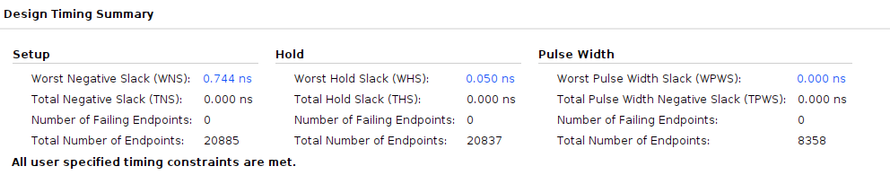
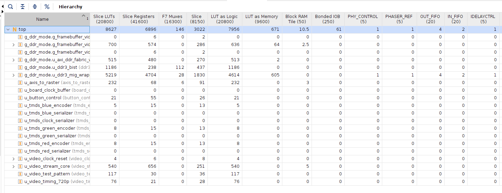
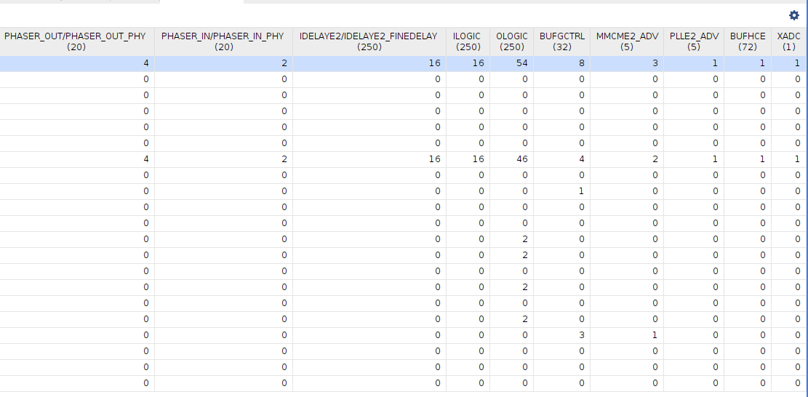
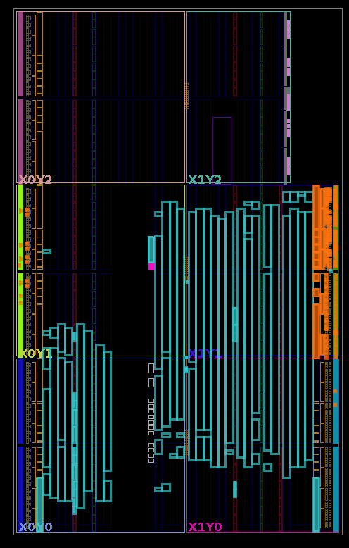
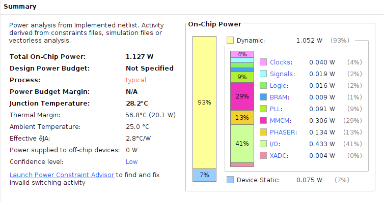

# FPGA Build and Implementation

## 1. Reproducible build contract

The release implementation is driven by `fpga/vivado/build.tcl`, not by an manually maintained GUI project. The script:

1. creates a fresh project for `xc7a35tfgg484-2`;
2. adds project RTL and the mode-specific XDC set;
3. imports and regenerates the Clocking Wizard and MIG customizations;
4. creates the 3-to-1 AXI4 fabric from checked-in block-design Tcl;
5. applies `DEMO_MODE` as a top-level generic;
6. runs synthesis, implementation, and bitstream generation;
7. produces timing, utilization, DRC, `check_timing`, and mode-dependent bus-skew reports;
8. fails when implementation does not complete, setup/hold slack is negative, or required internal timing checks are not clean.

Generated products are written under `build/vivado/` and are excluded from Git.

```bash
DEMO_MODE=1 VIVADO_JOBS=4 make vivado
```

To inspect the resulting implementation interactively:

```bash
vivado -mode gui build/vivado/project/fpga_video_stream_processor.xpr
```

The GUI is for investigation and screenshots. A release must still pass the batch command so its result does not depend on undocumented GUI edits.

## 2. Target consistency

The selected device is the fitted MicroPhase A7-Lite 35T speed-grade `-2` FPGA:

```text
xc7a35tfgg484-2
```

The following sources must agree before a release build:

- `fpga/vivado/build.tcl` project part;
- MIG project/XCI target;
- Clocking Wizard device target;
- board constraint set;
- implemented-design timing report `Speed File`.

In the Vivado Tcl Console:

```tcl
get_property PART [current_project]
get_property PART [current_design]
report_ip_status
report_timing_summary -delay_type min_max -report_unconstrained
```

The project and current design must report `xc7a35tfgg484-2`; the routed timing header must use speed file `-2`. Changing only the GUI part is insufficient: synthesis and implementation must be reset and rerun so no checkpoint from a `-1` build remains in the evidence.

## 3. Latest post-route snapshot

The latest local GUI capture supplied for the DDR-enabled implementation reports:

| Metric | Result |
| --- | ---: |
| Configuration | `DEMO_MODE=1` |
| Vivado | 2024.1 |
| Setup WNS | `+0.744 ns` |
| Setup TNS | `0.000 ns` |
| Setup failing endpoints | 0 |
| Hold WHS | `+0.050 ns` |
| Hold THS | `0.000 ns` |
| Hold failing endpoints | 0 |
| Pulse-width failing endpoints | 0 |

The positive setup and hold slack close the reported timing constraints. The `0.000 ns` displayed worst pulse-width slack is not a violation because total pulse-width slack is zero and there are no failing endpoints. It should still be reviewed at full report precision rather than described as having positive margin.



The repository capture now matches the reported mode-1 timing summary: WNS
`+0.744 ns`, WHS `+0.050 ns`, zero total setup/hold violation, and zero failing
endpoints. Before tagging, archive the full text report and its header so the
image is bound to the exact speed-grade `-2` release commit rather than relying
on the cropped GUI summary alone.

## 4. Resource utilization



| Resource | Used | Available | Utilization |
| --- | ---: | ---: | ---: |
| Slice LUTs | 8,627 | 20,800 | 41.5% |
| Slice registers | 6,896 | 41,600 | 16.6% |
| F7 muxes | 146 | 16,300 | 0.9% |
| Slice sites | 3,622 | 8,150 | 44.4% |
| LUT as logic | 7,956 | 20,800 | 38.3% |
| LUT as memory | 671 | 9,600 | 7.0% |
| Block RAM tiles | 10.5 | 50 | 21.0% |
| Bonded I/O | 61 | 250 | 24.4% |
| MMCM | 3 | 5 | 60% |
| PLL | 1 | 5 | 20% |

The hierarchy capture shows why a top-level number alone is insufficient:

- `video_stream_core` uses approximately 540 LUTs, 656 registers, and 5 BRAM tiles;
- `axis_to_raster` uses approximately 232 LUTs, 68 registers, and 3 BRAM tiles;
- generated MIG infrastructure dominates the routed design with approximately 5,219 LUTs and 4,704 registers;
- the AXI fabric and custom framebuffer logic remain visibly separable from the MIG cost.

This supports the intended ownership story: the reusable image core is compact, while external DDR3 PHY/controller infrastructure carries most of the implementation overhead.

The second GUI capture contains device-specific resources omitted by horizontal scrolling in the first image:



## 5. Device placement



The placement view confirms that the supplied screenshot is from an implemented DDR-enabled design rather than a processing-core-only synthesis. It is useful visual context, but the machine-readable utilization and timing reports remain the authoritative evidence.

## 6. Power estimate



| Metric | Estimate |
| --- | ---: |
| Total on-chip power | 1.127 W |
| Dynamic | 1.052 W |
| Device static | 0.075 W |
| Junction temperature | 28.2 °C |
| Thermal margin | 56.8 °C |
| Confidence | Low |

This is a post-implementation vectorless estimate derived from constraints/default activity, not measured board power. It is acceptable as a labeled engineering estimate, but it must not be described as measured consumption. A higher-confidence release estimate requires realistic switching activity from SAIF/VCD or reviewed per-net activity assumptions.

The large MMCM/PLL/PHASER/I/O contribution is expected for a design containing MIG and high-speed video clocking. The estimate is not directly comparable to a core-only power number.

## 7. DRC review

The supplied routed design reports zero errors, zero critical warnings, and three warnings inside generated MIG hierarchy:

| Rule | Count | Location/meaning |
| --- | ---: | --- |
| `BUFC-1` | 2 | DQS `IBUFDS` input branch reported without an internal load |
| `REQP-1709` | 1 | One MIG `PLLE2_ADV` output uses a different buffer type, so phase alignment with other outputs is not guaranteed |

These warnings do not fail implementation, but they are not silently called “DRC clean.” They may be accepted only if:

- the hierarchy and rule IDs remain unchanged after IP regeneration;
- MIG/IP status is compatible with the `-2` target;
- timing and bus-skew checks remain clean;
- the fitted DDR configuration and pins are reviewed;
- repeated MIG calibration and destructive BIST pass on hardware.

Do not edit generated MIG RTL to suppress them. Record them as reviewed generated-IP warnings or regenerate/repair the IP if their hierarchy or count changes.

## 8. CDC and timing checks

The design includes asynchronous pixel/UI boundaries and related pixel/TMDS clocks. Required post-route checks are:

```tcl
check_timing -verbose
report_timing_summary -delay_type min_max -report_unconstrained
report_cdc -details
report_clock_interaction
report_bus_skew
```

At minimum:

- `no_clock = 0`;
- `unconstrained_internal_endpoints = 0`;
- setup, hold, and pulse-width failing endpoints are zero;
- asynchronous FIFO Gray-pointer synchronizers are recognized;
- the vblank toggle/acknowledge path is the intended event crossing;
- pixel/TMDS clocks retain their exact 5:1 generated-clock relationship;
- bus-skew constraints have no violated path.

No CDC screenshot is required in the top-level README. The report is still a release artifact because CDC-safe frame buffering is a core architectural claim.

## 9. Report provenance and publication rules

Every published implementation table or screenshot should state:

```text
Vivado version
FPGA part and speed grade
DEMO_MODE
post-synthesis or post-route design state
Git commit
constraint set
```

Results from different configurations must not be combined. A direct-mode timing screenshot, DDR-mode utilization table, and old `-1` power estimate do not form one valid evidence set.

The release archive should preserve text reports rather than only screenshots:

```text
timing_summary.rpt
check_timing_verbose.rpt
utilization.rpt
drc.rpt
cdc.rpt
clock_interaction.rpt
bus_skew.rpt
power.rpt
ip_status.rpt
```

Screenshots are presentation assets. Reports are the reviewable source of the numbers.

## 10. Remaining implementation closure

- Capture and archive the current mode-1 speed-grade `-2` timing report.
- Generate and review CDC, clock-interaction, power, methodology, and IP-status reports in the batch flow or release procedure.
- Bind the final evidence to a clean commit and record the Vivado command/version.
- Complete the physical validation gates in [hardware-validation.md](hardware-validation.md).

The implementation is timing-closed based on the supplied summary. Full release sign-off remains configuration-specific and requires report provenance plus hardware DDR qualification.
