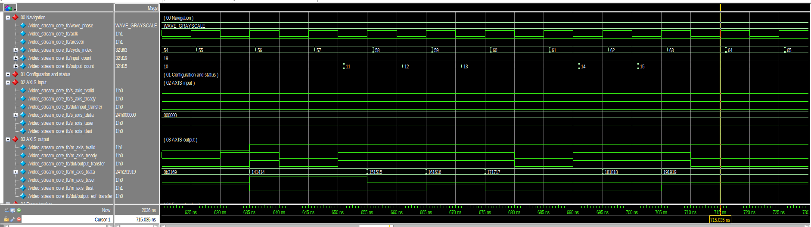

# Verification Results

## 1. Evidence snapshot

| Field | Value |
| --- | --- |
| Latest portable regression | 2026-08-15 local working tree |
| Command | `make ci` |
| Overall result | Pass |
| Verilator | 5.049 development build shown in the regression transcript |
| Python | 3.10.14 virtual environment shown in the cocotb transcript |
| cocotb | 2.0.1, pinned in `requirements-dev.txt` |
| Reproducible CI entry point | `.github/workflows/ci.yml` → `make PYTHON=python ci` |

The source tree contained uncommitted release work when the local run was captured. Before tagging a release, rerun the same command from the final commit and archive the GitHub Actions result or complete transcript against that commit.

## 2. Regression summary

| Layer | Scope | Result |
| --- | --- | ---: |
| Lint | Board top in direct mode, async FIFO, WDMA, RDMA, controller, and framebuffer subsystem | Pass |
| Unit RTL | 22 self-checking SystemVerilog targets | 22/22 pass |
| Integration RTL | Full-frame WDMA/RDMA, loopback, framebuffer subsystem, video core, and board top | 6/6 pass |
| Python models | Video arithmetic and framebuffer transaction/ownership behavior | 16/16 pass |
| cocotb | Core and framebuffer suites | 5/5 pass |

The final cocotb summary reported:

```text
TESTS=2 PASS=2 FAIL=0 SKIP=0
cocotb: PASS (5 tests across 2 suites)
```

The first line is the framebuffer suite summary shown at the end of its simulator run. The aggregate runner then reports five tests across both registered suites.

## 3. Unit-level closure

### Stream and processing blocks

- `axis_elastic_buffer`: fall-through/full behavior, simultaneous push/pop, prolonged stall, and reset.
- `frame_coord_tracker`: legal frames, coordinates, SOF/EOL placement, dimensions, malformed markers, and resynchronization.
- `rgb_to_gray`: directed colors, rounding, random values, and backpressure.
- `window_3x3`: minimum dimensions, line-bank rotation, borders, bubbles, and read/write behavior.
- `sobel_gx_gy`: flat fields, horizontal/vertical edges, both polarities, and gradient extrema.
- `sobel_magnitude`: absolute-value behavior, saturation, threshold scaling, and strict equality boundary.
- `stream_align_delay`: payload/metadata alignment with branch stalls.
- `video_mode_mux`: all modes and frame-atomic configuration changes.

### Memory and ownership blocks

- `axis_async_fifo`: unrelated clocks, fill/drain, full/empty transitions, sustained flow, and reset.
- `framebuffer_pkg`: geometry, alignment, slot, address, and packing invariants.
- `framebuffer_write_dma`: frame checking, AXI channel stalls, burst formation, final response, error telemetry, and recovery.
- `framebuffer_read_dma`: read latency/stalls, AXI response checking, output backpressure, regenerated SOF/EOL, and recovery.
- `framebuffer_control`: legal ownership transitions, initial promotion, swapping, repeat-frame behavior, error paths, and deadline handling.
- `ddr3_bist`: write/read patterns, response handling, completion, and failure containment.
- `ddr3_mig_wrapper`: reset/calibration gating against behavioral IP stubs.

### Display and board blocks

- Clock/reset synchronization and lock-loss behavior.
- 1280×720 timing totals and sync polarity.
- Test-pattern contents and stream framing.
- AXI-to-raster fill/lock/fallback behavior.
- Button mode/threshold control.
- TMDS data/control encoding and running disparity.

The OSERDESE2 serializer has a separate Xsim/UNISIM target because a portable Verilator model is not equivalent to the Xilinx physical primitive.

## 4. Integration evidence

### Video core

`video_stream_core_tb` divides the run into deterministic phases:

| Phase | Scenario |
| ---: | --- |
| 0 | Reset and startup |
| 1 | Legal 1×1 frame and output drain |
| 2 | SOF-atomic configuration commit |
| 3 | Grayscale under randomized stalls |
| 4 | Sobel magnitude and border alignment |
| 5 | Strict binary-threshold comparison |
| 6 | One accepted pixel per clock |
| 7 | Unexpected-SOF recovery and resynchronization |
| 8 | All self-checking scenarios passed |

The test checks output stability while stalled, exact transaction accounting, exact SOF/EOL positions, final-frame drain, and the absence of a false protocol error when the next frame legally holds SOF during backpressure.



At the cursor in the grayscale phase, `m_axis_tvalid=1`,
`m_axis_tready=0`, and `output_transfer=0`. The end-of-line token retains
`TDATA=0x191919` and `TLAST=1` until acceptance. Earlier intervals in the same
capture show equivalent stalls at SOF and at an intermediate pixel.

### Full-frame memory traffic

| Test | Evidence |
| --- | --- |
| Full-frame WDMA | Accepts and commits one 1280×720 frame |
| Full-frame RDMA | Emits 921,600 pixels from 14,400 AXI bursts |
| WDMA→memory→RDMA loopback | 512 ordered pixels cross both engines and the memory model |
| Framebuffer subsystem | FB0 fill, vblank promotion, FB1 fill, and double-buffer swap |

The full-frame tests are important because tiny unit geometries do not expose line-stride rollover, long burst sequences, late-frame bookkeeping, or accumulated pixel-count errors.

### cocotb core suite

The core suite uses the NumPy model as an independent pixel oracle. It covers:

- all four processing modes;
- source gaps and output backpressure;
- exact RGB, SOF, and EOL comparison;
- output stability during stalls;
- frame-atomic configuration changes;
- protocol-error injection and recovery.

### cocotb framebuffer suite

The framebuffer suite compares every accepted AXI transaction with `models/framebuffer_model.py`. It checks:

- AW address and length;
- 128-bit WDATA packing and WSTRB;
- burst ordering and 4 KiB safety;
- final memory contents;
- response-qualified frame completion;
- first-error kind/address/response preservation;
- failure followed by a successful recovery frame.

## 5. Reference-model independence

The video model uses integer operations and explicitly reproduces RTL rounding, signed ranges, zero-border behavior, saturation, and threshold scaling. OpenCV is not the pass/fail reference because default border and numeric behavior could differ from the hardware contract.

The framebuffer model works at transaction level rather than translating RTL state machines into Python. It owns expected pixel addresses, XRGB packing, burst planning, sparse memory semantics, and slot ownership outcomes. This reduces the risk that DUT and model share the same implementation mistake.

## 6. What `make ci` proves

The portable regression provides strong evidence for:

- synthesizable RTL and consistent widths/signedness under Verilator;
- AXI4-Stream transaction safety under directed and randomized stalls;
- exact grayscale/Sobel output against an independent model;
- full-frame DMA addressing, packing, response handling, and recovery;
- double-buffer state/command behavior in simulation;
- portable board-top timing/raster behavior with vendor primitives stubbed.

It does not prove:

- Xilinx primitive behavior or physical TMDS signal integrity;
- MIG PHY calibration on the fitted DDR3 device;
- sustained read/write DDR service on the board;
- post-route CDC correctness by simulation alone;
- thermal or power behavior under measured switching activity.

Those items belong to Xsim, Vivado implementation review, and hardware validation.

## 7. Remaining verification actions

- Rerun `make ci` on the final clean release commit and preserve CI evidence.
- Run `make test-xsim` for the serializer/UNISIM boundary.
- Run `make test-questa-core` when a licensed Questa installation is available and capture the curated backpressure/recovery waveform.
- Either implement the Yosys structural connectivity check referenced by the specification or remove it from the release requirements. Yosys is installed locally but is not currently a repository target.
- Archive post-route timing, unconstrained-path, DRC, and CDC reports for the exact `DEMO_MODE=1` release build.
- Complete physical MIG/BIST/DDR-video validation described in [hardware-validation.md](hardware-validation.md).

The planned coverage space and sign-off criteria remain in [verification-plan.md](verification-plan.md). This document records achieved evidence and intentionally does not convert planned tests into claimed results.
